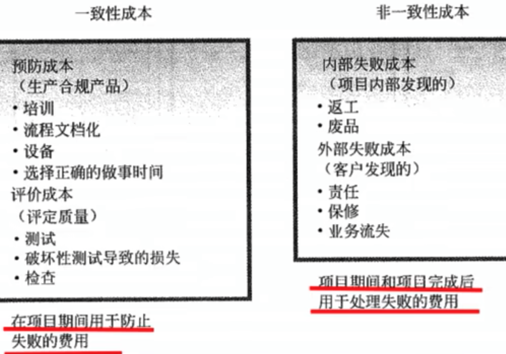

# 项目质量管理

ISO 对质量（Quality）的定义：“反映实体满足主体明确和隐含需求的能力的特性总和”。

国家标准对质量的定义：“一组固有特性满足要求的程度”。

质量与等级是两个不同的概念。

低等级、高质量的产品，适合一般使用，可以被认可。
高等级、低质量的产品，会因质量低劣而无效或低效，不会被使用者接受。

从项目作为一次性的活动来看，项目质量体现在由 WBS 反映出的项目范围内所有的阶段、子项目、项目工作单元的质量所构成，即项目的工作质量。
从项目作为一项最终产品来看，项目质量体现在其性能或使用价值上，即项目的产品质量。

质量管理（Quality Management）是指确定质量方针、目标和职责，并通过质量体系中的质量规划、质量保证和质量控制以及质量感觉来使其实现所有管理职能的全部活动。
（质量管理是为了实现质量目标而进行的所有质量性质的活动）

质量管理的四个阶段：

1. 手工艺人时代。
2. 质量检验阶段。只能剔除次品和废品
3. 统计质量控制阶段。基于统计提出质量改进观点
4. 全面质量管理阶段。强调全员参与

**项目质量管理由过程组成，是项目管理的重要组成部分，包括确定质量政策、目标与职责的各过程和活动**。具体包括

1. 规划质量管理
2. 实施质量保证
3. 质量控制

## 规划质量管理

规划质量管理是识别项目及其可交付成果的质量要求和标准，并准备对策确保符合质量要求的过程。

主要作用是为整个项目中如何管理和确认质量提供了指南和方向。

### 规划质量管理的输入

1. 项目管理计划
   1. 范围基准
      1. 项目范围说明书
      2. WBS
      3. WBS 词典
   2. 进度基准
   3. 成本基准
   4. 其他管理计划
2. 干系人登记册
3. 风险登记册
4. 需求文件
5. 事业环境因素
   1. 政府法规
   2. 特定应用领域的相关规则、标准和指南
   3. 可能影响项目质量的项目或可交付成果的工作条件或允许条件
   4. 可能影响质量期望的文化观念
6. 组织过程资产
   1. 组织的质量政策、程序及指南
   2. 历史数据库
   3. 以往阶段或项目的经验教训

### 规划质量管理的工具和技术

1. 成本效益分析法。比较可能的成本与预期的效益
2. 质量成本法。在生命周期中发生的所有成本，包括为预防不符合要求、为评价产品或服务是否符合要求，以及因未达到要求而发生的所有成本。
3. 7 种基本质量工具。（老 7 种，**常用常考**）
   1. 因果图。又称鱼骨图或石川图，发现根本原因。
   2. 流程图。有助于了解和估算一个过程的质量成本
   3. 核查表。又称计数表，用于收集数据的核对清单。收集关于缺陷数量或后果的数据
   4. 帕累托图。2-8 原则，识别大多数问题的少数重要原因。
   5. 直方图。秒速集中趋势、分散程度和统计分布形状
   6. 控制图。确定一个过程是否稳定。上限与下限之间，且在中心两边分布，则表示稳定。
   7. 散点图。因变量 Y 相对于自变量 X 的相关性
4. 标杆对照
5. 实验设计
6. 统计抽样
7. 其他质量管理工具
   1. 头脑风暴
   2. 力场分析。阻力和推力分析。
   3. 名义小组技术
8. 会议

### 规划质量管理的输出

1. 质量管理计划。项目管理计划的组成部分。可以是正式的，也可以是非正式的。可以是高度概括的，可以是详细的。
2. 过程改进计划
   1. 过程边界。秒速国臣的目的、过程的开始和技术、过程的输入输出、过程责任人和干系人。
   2. 过程配置。含有确定界面的过程图形，便于分析。
   3. 过程测量指标。与控制界限一起吗用于分析过程的效率。
   4. 绩效改进目标。用于指导过程改进活动。
3. 质量测量指标
   1. 准时性
   2. 成本控制
   3. 缺陷频率
   4. 故障率
   5. 可用性
   6. 可靠性
   7. 测试覆盖度
4. 质量和对单
5. 项目文件更新
   1. 干系人登记册
   2. 责任分配矩阵
   3. WBS 和 WBS 词典

## 实施质量保证

实施质量保证是审计质量要求和质量控制测量结果，确保采用合理的质量标准和操作性定义的过程。
主要作用是，促进质量过程改进。

质量保证旨在建立对未来输出或完全输出将在完工时满足特定的需求和期望的信心。

质量保证部门或类似部门经常要对质量保证活动进行监督。

实施质量保证过程野味持续过程改进创造条件。

### 实施质量保证的输入

1. 质量管理计划
2. 过程改进计划
3. 质量测量指标
4. 质量控制测量结果
5. 项目文件

### 实施质量保证的工具和技术

1. 质量审计。
2. 过程分析
3. 质量管理和控制工具（新 7 种）
   1. 亲和图。针对某个问题，产生出可联成有组织的想法模式的各种创意。有助于 WBS 的制定。
   2. 过程决策程序图（PDPC）。理解一个目标与达成此目标的步骤之间的关系。有助于制定应急计划
   3. 关联图。关系图的编著，有助于在包含相互交叉逻辑的中等复杂清醒中创新性的解决问题。
   4. 树形图。又称系统图，用层次分解形式直观地展示父子关系。
   5. 优先矩阵。识别关键事项和合适的备选方案。
   6. 活动网络图。
   7. 矩阵图。

#### 质量审计

质量审计又称质量保证体系审核，是对具体质量管理活动的结构性的评审。

质量审计可以是事先安排，也可以随机进行。
在具体领域中有专长的内部审计师或第三方组织都可以实施质量审计。（可由内部或外部审计师进行）

其目标是：

1.  识别全部正在实施的良好及最佳时间
2.  识别全部违规做法、差距及不足
3.  分享所在组织或行业中类似项目的良好实践
4.  积极、主动低提供协助，以改进过程的执行，从而帮助团队提高生产效率
5.  强调每次审计都应对组织经验教训的积累作出 贡献

### 实施质量保证的输出

1. 变更请求
2. 项目管理计划更新
   1. 质量管理计划
   2. 范围管理计划
   3. 进度管理计划
   4. 成本管理计划
3. 项目文件更新
   1. 质量审计报告
   2. 培训计划
   3. 过程文档
4. 组织过程资产更新

## 质量控制

质量控制是监督并记录质量活动执行结果，以便评估绩效，并推荐必要的变更的过程。

主要作用：

1. 识别过程低效或产品质量低劣的原因，建议并采取相应措施消除这些原因
2. 确认项目的可交付成果及国做满足主要干系人的既定需求，足以进行最终验收。

### 质量控制的输入

1. 项目管理计划
2. 质量测量指标
3. 质量和对单
4. 工作绩效数据
   1. 实际技术性能（与计划比较）
   2. 实际进度绩效（与计划比较）
   3. 实际成本绩效（与计划比较）
5. 批准的变更请求
6. 可交付成果
7. 项目文件
   1. 协议
   2. 质量审计报告和变更日志（附有纠正行动计划）
   3. 培训计划和效果苹果
   4. 过程文档
8. 组织过程资产
   1. 组织的质量标准和政策
   2. 标准化的工作指南
   3. 问题与缺陷报告程序及沟通政策

### 质量控制的工具和技术

1. 7 种基本质量工具（老七种）
2. 统计抽样
3. 检查
4. 审查已批准的变更请求

### 质量控制的输出

1. 质量控制测量结果
2. 确认的变更
3. 核实的可交付成果
4. 工作绩效信息
5. 变更请求
6. 项目管理计划更新
   1. 质量管理计划
   2. 过程改进计划
7. 项目文件更新
   1. 质量标准
   2. 协议
   3. 质量审计报告和变更日志（附有纠正行动计划）
   4. 培训计划和效果苹果
   5. 过程文档
8. 组织过程资产更新
   1. 完成的核对但
   2. 经验教训文档
