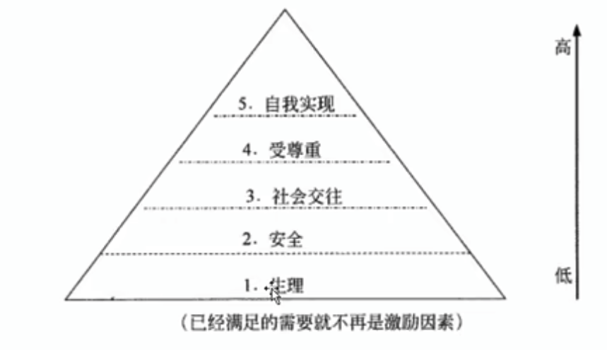

# 项目人力资源管理

项目中的所有活动，归根结底都是由人来完成的。

IT 高技术行业中，成员的特征是高学历、高素质，流动性强，年轻、个性独立。
工作强度大又是 IT 行业的显著特征。

项目人力资源管理的过程：

1. 编制项目人力资源管理计划。确定和识别项目中的角色、所需技能、分配项目职责和回报关系，并记录下来形成书面文件，其中也包括项目人员配备管理计划。
2. 组建项目团队。通过调配、招聘等方式获得需要的项目人力资源。
3. 建设项目团队。培养提高团队个人的技能，改进团队协作，提高团队的整体水平，以提升项目绩效。
4. 管理项目团队。跟踪团队成员个人的绩效和团队的绩效，提供反馈，解决问题并协调变更以提高项目绩效。

项目团队包括为完成项目而承担了相应的角色和责任的人员。
团队成员应该参与大多数项目计划和决策工作。

项目团队成员是项目的人力资源。

项目管理团体是项目团队的一个子集，负责编制计划、实施、控制和收尾项的项目的管理活动。

项目团队的管理与领导：

- 对项目团队施加影响。
- 强调职业道德，规范职业行为。

在实际管理项目的过程中，处理人际关系还涉及许多技能：

1. 领导、沟通、谈判、协商与其他管理技能
2. 授权、激励士气、指导、劝告及其他与处理个人关系有关的技能。
3. 团队建设、冲突解决及其他与处理团队关系有关的技能
4. 绩效评定、招聘、留用、劳工关系、健康与安全规定及其他与管理人力资源有关的技能。

项目人力资源管理就是有效地发挥每一个参与项目人员的作用，把合适的人组成一个战斗力超强的团队的过程。

- 动机
- 组织结构图
- 责任
- 任务分配矩阵或责任分配矩阵
- 专门技术
- 员工绩效

## 编制项目人力资源管理计划

通过编制项目人力资源管理计划过程，确定项目的角色、职责以及汇报关系，并编制人员配备管理计划。

在编制项目人力资源计划时，要注意到与项目成本、进度、风险、质量及其他因素间的相互影响，
同时也应注意到其他项目对同类人员对争夺，所以项目要有备选人员。

大多数时候，该过程主要作为项目最初阶段的一部分，但需要在整个项目生命周期中进行经常性地复查，以保证它的持续适用性。

### 编制项目人力资源管理计划的输入

1. 项目管理计划
   1. 项目生命周期和拟用于每个阶段的过程
   2. 为完成项目目标，如何执行各项工作
   3. 变更管理计划，规定如何监控变更
   4. 配置管理计划，规定如何开展配置管理
   5. 如何维持项目基准的完整性
   6. 干系人之间的沟通需求和方法
2. 活动资源需求
3. 事业环境因素
   1. 组织、文化和结构
   2. 现有的人力资源与人力政策
   3. 后勤保障
   4. 人事管理政策
   5. 市场条件
   6. 人际关系及政治因素
4. 组织过程资产
   1. 组织的标准流程、政策和角色描述，以及统一的岗位描述
   2. 组织结构图与岗位描述的模版
   3. 以往项目中与组织结构有关的经验教训
   4. 团队和项目执行组织内用于解决问题的升级程序

### 编制项目人力资源管理计划的工具和技术

1. 组织结构图和职位描述。描述项目的角色和职责。
   1. 层次结构图
      1. 工作分解结构（WBS）
      2. 组织分解结构（OBS）
      3. 资源分解结构（RBS）
   2. 矩阵图
   3. 文本格式
   4. 项目计划其他部分
2. 人际交往
3. 组织理论
4. 专家判断

### 编制项目人力资源管理计划的输出

1. 项目人力资源管理计划
   1. 角色和职责分配
      1. 角色
      2. 职权
      3. 职责
      4. 能力
   2. 项目组织机构图
   3. 人员配备管理计划
      1. 人员招募
      2. 资源日历
      3. 人员遣散计划
      4. 培训需求
      5. 表彰和奖励
      6. 遵守的规定
      7. 安全性

## 组建项目团队

组建项目团队过程包括获得所需的人力资源，将其分配到项目中工作。

在大多数情况下没可能无法得到“最理想”的人力资源，但项目管理小组必须保证所用的人员能符合项目的要求。

应特别注意：

1. 项目经理或项目管理团队应该进行有效协商或谈判，并影响那些能为项目提供所需人力资源的人员。
2. 不能获得项目所需的人力资源，可能影响项目进度、预算、客户满意度、质量和风险。
   人力资源不足或人员能力不足会降低项目成功的概率，甚至可能导致项目取消。
3. 制约因素导致无法获得所需人力资源，在不违反法律、规章、强制性规定或其他具体标准的前提下，项目经理或项目团队可能不得不适用替代资源

### 组建项目团队的输入

1. 项目人力资源管理计划
   1. 角色和职责
   2. 项目的组织结构图
   3. 人员配备管理计划
2. 事业环境因素
   1. 现有人力强看
   2. 项目实施单位的人事管理政策
   3. 项目实施单位的组织结构
   4. 集中办公或多个工作地点
3. 组织过程资产

### 组建项目团队的工具和技术

1. 事先分派
2. 谈判
3. 招募
4. 虚拟团队。
5. 多维决策分析

虚拟团队可以定义为有共同目标、在完成各自任务过程中很少有时间或者没有时间能面对面工作的一组人员。（远程办公团队）

### 组建项目团队的输出

1. 项目人员分配表
2. 资源日历
3. 可能作出的项目管理计划更新

## 建设项目团队

项目团队建设工作包括提高项目相关人员的技能、改进团队协作、全面改进项目环境，其目标是提高项目的绩效。

项目团队建设的主要目标：

1. 提高项目团队成员的个人技能
2. 提高项目团队成员之间的信任感和凝聚力
3. 创建动态的、团结合作的团队文化

成功的项目团队特点：

1. 团队的目标明确，成员清楚自己的工作对目标的贡献
2. 团队的组织结构清晰，岗位明确
3. 有成文或习惯的工作流程和方法，而且流程简明有效
4. 项目经理对团队成员有明确的考核和评价标准，工作结果公开公正、赏罚分明。
5. 共同制定并遵守的组织纪律
6. 协同工作

项目团队建设的 5 个阶段

1. 形成阶段
2. 震荡阶段
3. 规范阶段
4. 发挥阶段
5. 结束阶段

### 建设项目团队的输入

1. 项目人力资源管理计划
2. 项目人员分派表
3. 资源日历

### 建设项目团队的工具和技术

1. 人际关系技能
2. 培训
3. 团队建设活动
4. 基本规则
5. 集中办公
6. 认可与奖励
7. 人事测评工具

### 建设项目团队的输出

1. 团队绩效评估
   1. 提高个人技能
   2. 提高团队能力
   3. 较低的员工流动率
   4. 团队凝聚力的加强
2. 事业环境因素更新

团队效率的评估可以包含以下几个指标：

1. 技能的改进
2. 能力和情感方面的改进
3. 团队成员流动率降低
4. 增加团队的凝聚力

## 管理项目团队

项目团队管理是指跟踪个人和团队的绩效，提供反馈，解决问题和协调变更，以提高项目的绩效。

项目管理团队必须观察团队的行为、管理冲突、解决问题和评估团队成员的绩效。

### 管理项目团队的输入

1. 项目人力资源管理计划
2. 项目人员分派表
3. 团队绩效评估
4. 问题日志
5. 绩效报告
6. 组织文化和组织过程资产

### 管理项目团队的工具和技术

1. 观察和交通
2. 项目绩效评估
3. 冲突管理
4. 人际关系技能

#### 冲突管理

冲突，就是计划与现实之间的矛盾，或人与人之间不同期望之间的矛盾，或人与人之间不同利益之间的矛盾。

在管理项目过程中，最主要的冲突有 7 种：

- 进度
- 项目优先级
- 资源
- 技术
- 管理过程
- 成本
- 个人冲突

在项目个阶段，冲突的排列次序

1. 概念阶段：项目优先级冲突、管理过程冲突、进度冲突
2. 计划阶段：项目优先级冲突、进度冲突、管理过程冲突
3. 执行阶段：进度冲突、技术冲突、资源冲突
4. 收尾阶段：进度冲突、资源冲突、个人冲突

项目冲突应该被尽早发现，利用私下但直接的、合作的方式来处理冲突。
如果冲突持续分裂，那么需要使用正式的处理过程，包括惩戒措施。

1. 冲突是自然的，而且要找出一个解决办法
2. 冲突是一个团队的问题，而不是某个人的个人问题
3. 应公开地初六冲突
4. 冲突的解决应聚焦在问题，而不是人身攻击
5. 冲突的解决应聚焦在现在，而不是过去

冲突的根源：

1. 项目的高压环境
2. 责任模糊
3. 存在多个上级
4. 新科技的使用

冲突的 6 种解决办法：

1. 问题解决
2. 合作
3. 强制
4. 拖鞋
5. 求同存异
6. 撤退

### 管理项目团队的输出

1. 变更请求
2. 已更新的项目管理计划
3. 项目文件更新
4. 事业环境更新
   1. 对组织绩效评价的输入
   2. 个人技能更新
5. 已更新的组织过程资产
   1. 问题解决
   2. 组织绩效评估输入
   3. 历史信息和经验教训文档
   4. 组织的标准流程

## 现代激励理论级项目经理所需具备的影响力

### 激励理论，马斯洛需要层次理论

马斯洛需要层次理论是一个 5 层的金字塔结构。

1. 生理。衣食住行。
2. 安全。人身安全。安全被满足之前，人们一般不追求更高层的需要
3. 社会交往。友谊、爱情及隶属关系
4. 受尊重。自尊心和荣誉感
5. 自我实现。想要获得更大的空间以实现自我发展的需要



生理、安全、社会、自尊是基本的需要。

马斯洛需要层次理论有三个假设：

1. 人要生存，他的需求能够影响他的行为，只有未被满足的需要能够影响其行为，已得到满足的需要不再影响其行为
2. 人的需要按重要性从低到高排成金字塔形状
3. 当人的某一级需要得到满足后，才会最求更高一级的需要，如此逐级上升，称为他工作的动机

项目经理需要了解每一个成员的需要等级。

### 激励理论，赫兹伯格的双因素理论

双因素理论认为有两种完全不同的因素影响着人们的工作行为。

第一类是保健因素，与工作环境或条件有关的，能防止人们产生不满意感的一类因素。
例如，薪水、工资政策、个人生活等。
改进保健因素仅仅能消除工作中的不满意。

第二类是激励因素，与员工的工作本身或工作内容有关的，能促使人满产生工作满意感的一类因素，是高层次的需要。
包括成就、承认、责任、发展机会等。
当激励因素缺乏时，人们就会缺乏进取心。

### 激励理论，期望理论

期望理论认为，一个目标对人的激励程度受两个因素影响。

1. 目标效价，指实现该目标对个人有多大价值的主观判断。价值高则积极性高。
2. 期望值，指个人对实现该目标可能性大小的主观估计。可能性大才会努力争取实现。

### X 理论

X 理论主要体现了独裁型管理者对人性的基本判断，这种假设认为：

1. 一般人天性好逸恶劳，只要有可能就会逃避工作。
2. 人生来就以自我为中心，漠视组织的要求
3. 人缺乏进取心，逃避责任，甘愿听从指挥，安于现状，没有创造性。
4. 人们通常容易受骗，易受人煽动
5. 人们天生反对改革

即，人性本恶

崇尚 X 理论的领导者认为，必须对员工采取强制、惩罚和解雇等手段

### Y 理论

Y 理论对人性的假设与 X 理论相反：

1. 一般人天生并不是好逸恶劳，他们热爱工作，从工作得到满足感和成就感
2. 外来的控制和处罚对人们实现组织的目标不是一个有效的办法，下属能够自我确定目标，自我指挥和自我控制
3. 适当的条件下，人们愿意主动承担责任
4. 大多数人具有一定的想象力和创造力。
5. 现代社会中，人们的智慧和潜能只是部分地得到了发挥

即，人性本善

信封 Y 理论的管理者对员工采取民主型和放任自由型的领导方式

### 领导与管理

传统观念的领导指一个人被组织赋予的权利。
现代观念认为领导是一种影响力，对人们施加影响

领导行为理论的基本观点：领导者应该知道要做什么和怎样做才能使工作更有效。

领导权变理论的基本观点：认为不存在一种普遍适用、唯一正确的领导方式，只有具体问题具体分析才是有效的领导方式。

```
有效领导 = F(领导者, 被领导者, 环境)
```

### 影响和能力

在矩阵环境中，项目经理通常没有或仅有很小的命令职权，所以他们适时影响干系人的能力非常重要。
影响力体现在：

1. 说服别人，以及清晰表达观点和立场的能力
2. 积极且有效地倾听
3. 了解并总和考虑各种观点
4. 收集相关且关键的信息，以解决重要问题，维护相互信任，达成一致意见。

影响员工的方法：

1. 权利
2. 任务分配
3. 预算分配
4. 职员升职
5. 薪资待遇
6. 实施处罚
7. 工作挑战
8. 专门技术
9. 友谊

5 种基本的权利：

1. 合法的权利
2. 强制力
3. 专家权利
4. 奖励权利
5. 感召权利

有效的决策：

1. 着眼于所要达到的目标
2. 遵循决策流程
3. 研究环境因素
4. 分析可用信息
5. 提升团队成员个人素质
6. 激发团队创造里
7. 管理风险
