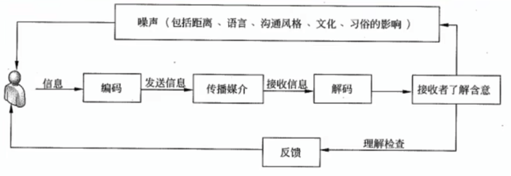

# 项目沟通管理

## 沟通的基本概念

在管理项目是，沟通是一个过程，是人们分享信息、表达思想和情绪的过程，
包括信息的生成、传递、接受、理解和检查。



**信息（Message）**是指多个参与者之间需要分享的的信息，表达思想和情感的组成物。
在沟通过程中，信息存在方式被定义为**符号（Symbol）**。

**渠道（Channel）**指信息在参与者之间传递的途径。

沟通的参与者在沟通的过程中，由于参与者的数量不同，潜在的沟通数量计算公式如下：

```
M = n * (n - 1)/2
```

- 当 n=1 时，参与者自身进行沟通，`M=0`
- 当 n=2 时，即 2 个人进行交流，`M=1`
- 当 n>2 时，也就是参与者众多的场景。

**反馈（Feedback）**是参与者之间针对信息的反应过程。

凡是发生在参与者之间，能够干扰和阻碍理解和解释信息的因素，都是**噪音（Noise）**。

噪音存在三种不同的形式：

1. 外部噪音。沟通环境
2. 内部噪音。参与者头脑
3. 语义噪音。不同文化，语言背景

沟通方式选择对比：

| 沟通过程方式 | 掌握信息的能力 | 需要听取他人想法 | 需要控制信息内容 | 典型代表 | 控制程度 | 参与程度 |
| ------------ | -------------- | ---------------- | ---------------- | -------- | -------- | -------- |
| 讨论         | 最弱           | 是               | 否               | 头脑风暴 | 最弱     | 最强     |
| 征询         | 较弱           | 是               | 否               | 调查问卷 | 较弱     | 较强     |
| 推销         | 较强           | 否               | 是               | 叙述解释 | 较强     | 较弱     |
| 叙述         | 最强           | 否               | 是               | 劝说股东 | 最强     | 最弱     |

沟通渠道的选择从两个维度进行考虑：

1. 及时性
2. 表达方式

沟通过程的有效性包括两个重要方面：

1. 效果。能够被正确的理解，最终参与方能正确的采取行动。
2. 效率。及时提供所需信息

具体沟通技能：

1. 主动倾听
2. 有效利用多种手段，帮助自己理解
3. 有效利用多种手段，加强团体的沟通技能
4. 不回避问题
5. 设定沟通目标，并采取必要的跟踪
6. 具有多层次的沟通协商能力
7. 强大的人格魅力和信用
8. 强大的表达能力

## 制定沟通管理计划

在项目的整个过程中，沟通无处不在，贯穿始终。

根据项目的规模大小及设计的干系人的特点，可以单独制订项目沟通管理计划。
可以作为整个管理计划的一部分而不需要形成单独的文档。

### 制定沟通管理计划的输入

1. 项目管理计划
2. 干系人登记册
   1. 主要沟通对象
   2. 关键影响人
   3. 次要沟通对象
3. 事业环境因素
4. 组织过程资产

### 制定沟通管理计划的工具和技术

1. 分析沟通需求
2. 沟通技术
3. 沟通模型
4. 沟通方法
   1. 交互式沟通
   2. 推式沟通
   3. 拉式沟通
5. 会议

识别和确定项目沟通需求时应包括：

1. 组织结构图
2. 组织与干系人的责任关系
3. 项目设计的学科、部门和专业
4. 参与项目的人数和地点
5. 内部信息需求
6. 外部信息需求
7. 干系人信息和沟通需求

### 制定沟通管理计划的输出

1. 项目沟通管理计划。
   包括以下内容：
   1. 干系人的沟通需求
   2. 针对沟通信息的描述
   3. 发布信息的原因
   4. 负责信息沟通工作的具体人员
   5. 负责信息保密工作的具体人员的授权
   6. 信息接受的个人和组织
   7. 沟通渠道的选择
   8. 信息传递过程中所需的技术或方法
   9. 进行有效沟通所必须分配的各种资源
   10. 沟通频率
   11. 上报过层
   12. 项目进行过程中，对沟通管理计划更新和细化的方法
   13. 通用词语表
   14. 术语表
   15. 项目信息流向图等
   16. 沟通过程中可能存在的各种制约因素
   17. 沟通工作指导以及相关模版
   18. 有利于有效沟通的其他放慢。
2. 项目文件更新
   1. 项目进度计划
   2. 干系人登记册

## 管理沟通

沟通管理计划制定后，在执行阶段，无特殊情况，应严格按照计划执行。

进行沟通过程管理的最终目标就是保障干系人之间有效地沟通。

### 管理沟通的输入

1. 项目沟通管理计划
2. 工作绩效报告
3. 事业环境因素
4. 组织过程资产

### 管理沟通的工具和技术

1. 沟通技术
2. 沟通模型
3. 沟通方法
4. 信息管理系统
5. 绩效报告

### 管理沟通的输出

1. 项目沟通
2. 更新的项目管理计划
3. 项目文件更新
4. 更新的组织过程资产
   1. 干系人通知
      1. 已解决问题
      2. 已批准变更
      3. 项目总体状态
   2. 项目报告
   3. 项目演示资料
   4. 项目日志
   5. 反馈信息
   6. 经验教训文档

## 控制沟通

在进行沟通控制的过程中，有可能需要重新调整、更新或重新制订沟通管理计划，也有可能需要重新调整、更新沟通过程的管理过程。

### 控制沟通的输入

1. 项目管理计划
2. 项目沟通
3. 问题日志
4. 工作绩效数据
5. 组织过程资产

### 控制沟通的工具和技术

1. 信息管理系统
2. 专家判断
3. 会议

### 控制沟通的输出

1. 工作绩效信息
2. 变更请求
3. 更新的项目管理计划
4. 更新的其他项目文件
5. 组织过程资产更新
