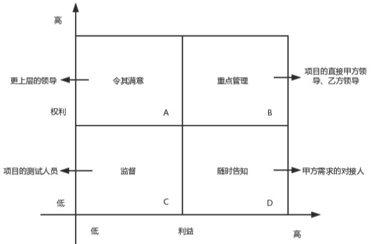

# 项目干系人管理

项目干系人管理，并不是领导项目的干系人，
而是对项目干系人的需要、希望和期望的识别，
并通过沟通上的管理来满足其需要、与干系人一起解决问题的多个过程。

努力争取更多干系人的支持、努力降低干系人中的反对者的阻力，持续不断地推动项目向目标前进。

项目干系人管理的具体内容：

1. 识别干系人
2. 编制干系人管理计划
3. 管理干系人参与
4. 控制干系人参与

## 识别干系人

项目干系人时能影响项目决策、活动或结果的个人、群体或组织，
以及会受或自人为会受项目决策、活动或结果影响的个人、群体或组织。

在项目启动时，就识别出关键干系人是非常重要的。
这样才能发现他们的诉求和影响力，
以便在项目的整个生命周期中通过与项目关键干系人的沟通和期望管理，使其行为对项目产生正面的影响。

项目的初期、在制定项目计划之前，就要识别项目的干系人，并分析他们的利益层次，个人期望、重要性和影响力。
应该定期审查和更新早起所做的初步分析。

### 识别干系人的输入

1. 项目章程
   1. 项目发起人、客户、团队成员、项目参与小组和部门等
   2. 项目受到等约束
2. 采购文件
3. 事业环境因素
   1. 项目实施单位等企业文化和组织架构
   2. 政府或行业标准
   3. 全球、区域或当地的趋势、实践或习惯
4. 组织过程资产
   1. 干系人记录的模板
   2. 以往项目或阶段的经验教训
   3. 以往项目的干系人记录

### 识别干系人的工具和技术

1. 组织相关会议
2. 专家判断
3. 干系人分析

干系人分析应遵循以下步骤。

1. 识别全部潜在项目干系人及相关信息，如他们的角色、部门、利益、知识水平、期望和影响力。
2. 识别每个干系人可能产生的影响或提供的支持，并把他们分类，以便制定管理策略。

分类方法包括：

1. 权利/利益方格
2. 权利/影响方格
3. 权利/作用方格
4. 凸显模型。根据干系人的权利、识别干系人紧急程度和合法性，对干系人进行分类。

### 识别干系人的输出

1. 干系人登记册
   1. 基本信息
   2. 用于评估的干系人信息
   3. 干系人分类

## 编制干系人管理计划

编制干系人管理计划过程，是基于对干系人需要、利益及对项目成功的潜在影响的分析，制定合适的管理策略，以有效调动干系人参与整个项目生命周期的过程。

### 编制干系人管理计划的输入

1. 项目管理计划
2. 干系人登记册
3. 事业环境因素
4. 组织过程资产

### 编制干系人管理计划的工具和技术

1. 组织相关会议
2. 专家判断
3. 分析技术
   1. 不了解。对项目和潜在影响不知晓
   2. 抵制。
   3. 中立。
   4. 支持。
   5. 领导。了解项目和潜在影响，积极致力于保证项目成功。

### 编制干系人管理计划的输出

1. 干系人管理计划。可以是正式的也可是非正式的。
2. 项目文件更新。
   1. 项目进度更新
   2. 干系人登记册

## 管理干系人参与

管理干系人参与就是依据干系人管理计划，在整个项目生命周期中，
与干系人进行日常的沟通和协作，以满足其需要与期望，促进干系人合理参与项目活动的过程。

管理干系人参与过程中涉及的活动：

1. 调动干系人适时参与项目
2. 及时化解反对者的第一
3. 通过协商和沟通，管理干系人的期望
4. 处理尚未成为问题的干系人关注点
5. 澄清和解决已识别出的问题

### 管理干系人参与的输入

1. 干系人管理计划
2. 沟通管理计划
3. 变更日志
4. 组织过程资产

### 管理干系人参与的工具和技术

1. 沟通方法
   1. 交互式沟通
   2. 推式沟通
   3. 拉式沟通
2. 人际关系技能
   1. 与干系人建立信任
   2. 解决冲突
   3. 积极琴亭
   4. 克服变更的阻力
3. 管理技能

### 管理干系人参与的输出

1. 问题日志
2. 变更请求
3. 项目管理计划更新
4. 项目文件更新
5. 组织过程资产更新

## 控制干系人参与

控制干系人参与是一个监控过程：这个过程实时观察计划与实际之间的偏差，全面监督项目干系人之间的关系。
发现问题时，及时调整策略和计划，以调动干系人参与的过程。

### 控制干系人参与的输入

1. 项目管理计划
2. 问题日志
3. 工作绩效数据
4. 项目文件

### 控制干系人参与的工具和技术

1. 信息管理系统
2. 专家判断
3. 组织相关会议

### 控制干系人参与的输出

1. 工作绩效信息
2. 变更请求
3. 项目管理计划更新
4. 项目文件更新
5. 组织过程资产更新
