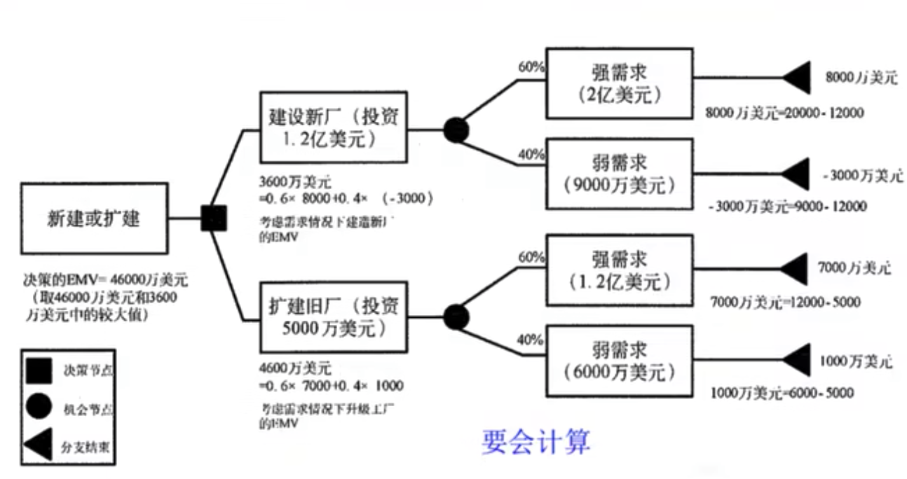

# 项目风险管理

风险定义由广义、狭义之分。

- 狭义的风险：损失的不确定性。
- 广义的风险：带来损失的可能性，也指可能获利的机会

狭义的风险表现为负面影响，广义的风险是一个中性词。

项目管理中的风险指的是广义的风险。

按性质划分风险的分类：

- 纯粹风险。只有损失可能性而无获利可能性的风险。
- 投机风险。投机风险是相对于纯粹风险而言，即有损失的可能也有获利机会。

按产生原因划分风险的分类

- 自然风险
- 社会风险
- 政治风险
- 经济风险
- 技术风险

按识别与否划分风险的分类：

1. 已识别风险
2. 未知风险

风险的性质：

- 客观性。不以人的意志为转移，独立于人的意识之外的客观存在。
- 偶然性。由于信息不对称，未来风险事件发生与否难以预测
- 相对性。风险性质因时空各种因素变化而有所变化
- 社会性。风险的后果与人类社会的相关性决定了风险的社会性，具有很大的社会影响力。
- 不确定性。发生时间的不确定性

组织和干系人的风险态度受多种因素影响：

- 风险偏好。保守 or 激进
- 风险承受力。组织或个人能承受的程度、数量或容积
- 风险临界值。干系人特别关注的特定的不确定性程度或影响程度。

> 示例：一个亿万富翁，仅投资自己了解的领域，日常生活丢了 100 RMB 也会特别心疼。
> 那么此人风格为保守、风险承受能力高、风险临界值低。

项目风险管理包括以下过程：

1. 规划风险管理。定义如何实施项目风险管理活动的过程
2. 识别风险。判断哪些风险可能影响项目并记录其特征的过程
3. 实施定性风险分析。评估并总和分析风险发生的概率和影响，对风险进行优先排序，为后续分析或行动提供基础的过程。
4. 实施定量风险分析。已识别风险对项目整体目标的影响进行定量分析的过程。
5. 规划风险应对。针对项目目标，制定提高机会、降低威胁的方案和措施的过程。
6. 控制风险。在整个项目中实施风险应对计划、跟踪已识别风险、监督残余风险、识别新风险，以及评估风险过程有效性的过程

## 规划风险管理

定义如何实施项目风险管理活动的过程。

主要作用是确保风险管理的程度、类型和可见度与风险即项目对组织的重要性相匹配。

### 规划风险管理的输入

1. 项目管理计划
2. 项目章程
3. 干系人登记册
4. 事业环境因素
5. 组织过程资产
   1. 风险类别
   2. 概念和术语的通用定义
   3. 风险描述的格式
   4. 标准模板
   5. 角色和职责
   6. 决策所需的职权级别
   7. 经验教训

### 规划风险管理的工具和技术

1. 分析技术
2. 专家判断
3. 会议

### 规划风险管理的输出

1. 风险管理计划。项目管理计划的组成部分。

风险管理计划包括以下内容：

1. 方法论
2. 角色与职责
3. 预算
4. 时间安排
5. 风险类别
6. 风险概率和影响的定义
7. 规律和影响矩阵
8. 修订的干系人承受力
9. 报告格式
10. 跟踪

## 识别风险

判断哪些风险可能影响项目并记录其特征的过程。

主要作用是把识别出的风险记录在案，并未项目团队预测未来事件积累知识和技能。

该过程应该全员参与，并贯穿整个项目周期。
项目经理应该鼓励全体项目人员参与潜在风险的识别工作

风险识别的原则：

1. 由粗及细，由细及粗
2. 严格界定风险内涵并考虑风险因素之间的相关性。
3. 先怀疑，后排除。
4. 排除与确认并重。对于肯定不能排除但又不能肯定予确认的风险，按确认考虑。
5. 必要时，可实验论证。

随着项目的进展，新的风险可能产生或为人所知。

### 识别风险的输入

1. 风险管理计划
2. 成本管理计划
3. 进度管理计划
4. 质量管理计划
5. 人力资源管理计划
6. 范围基准
7. 活动成本估算
8. 活动持续时间估算
9. 干系人登记册
10. 项目文件
11. 采购文件
12. 事业环境因素
13. 组织过程资产

_基本包含了其他管理知识领域所有过程的输出_

### 识别风险的工具和技术

1. 文档审查
2. 信息收集技术
   1. 头脑风暴
   2. 德尔非技术
   3. 访谈
   4. 根本原因分析
3. 核对单分析
4. 假设分析
5. 图解技术
   1. 因果图
   2. 系统或过程流程图
   3. 影响图
6. SWOT 分析。从项目的每个优势（Strength）、劣势（Weakness）、机会（Opportunity）、威胁（Threat）出发，对项目进行全面考察。
7. 专家判断

### 识别风险的输出

1. 风险登记册
   1. 已识别风险清单
   2. 潜在应对措施

## 实施定性风险分析

评估并总和分析风险发生的概率和影响，对风险进行优先排序，为后续分析或行动提供基础的过程。

主要作用是，使项目经理能够降低项目的不确定性级别，并重点关注高优先级的风险。

实施定性风险分析根据风险发生的概率或可能性、风险发生后对项目目标的相应影响及其他因素，来评估已识别风险的优先级。

实施定性风险分析通常可以快速且经济有效地为制定风险应对措施建立优先级，可以为实施定量风险分析奠定基础。

### 实施定性风险分析的输入

1. 风险管理计划
2. 范围集中
3. 风险登记册
4. 事业环境因素
5. 组织过程资产

### 实施定性风险分析的工具和技术

1. 风险概率和影响评估
2. 概率和影响矩阵。`风险值=风险发生的概率 * 风险发生后的后果`
3. 风险数据质量评估
4. 风险分类。风险分解结构、受影响的项目工作或其他有效分类标准
5. 风险紧迫性评估
6. 专家判断

### 实施定性风险分析的输出

1. 项目文件更新
   1. 风险登记册
   2. 假设条件日志
   3. 等等

## 实施定量风险分析

已识别风险对项目整体目标的影响进行定量分析的过程。

主要作用是，产生量化风险信息，来支持决策制定，降低 项目的不确定性。

实施定量风险分析的对象是在定性风险分析过程中被确定为对项目的竞争性需求**存在重大潜在影响的风险**。
实施定量风险分析过程就是分析这些风险对项目目标的影响，主要用来评估**所有风险对项目的总体影响**。
在进行定量分析时，也可以对单个风险分配优先级数值。

实施定量风险分析一般在实施定性风险分析过程之后开展，在没有足够的数据建立模型的时候，定量风险分析可能无法实施。

### 实施定量风险分析的输入

1. 风险管理计划
2. 成本管理计划
3. 进度管理计划
4. 风险登记册
5. 事业环境因素
6. 组织过程资产

### 实施定量风险分析的工具和技术

1. 数据收集和展示技术
   1. 访谈
   2. 概率分布
2. 定量风险分析技术和建模技术
   1. 敏感性分析。_有助于确定哪些风险对项目具有最大的潜在影响。_
   2. 预期货币价值分析。
   3. 建模和模拟。
3. 专家判断

#### 预期货币价值分析

预期货币价值（EMV）分析时当某些情况在未来可能发生或不发生时，计算平均结果的一种统计方式。

机会 EMV 为正值，威胁 EMV 为负值。

### 实施定量风险分析的输出

1. 项目的概率分析
2. 实现成本和时间目标的概率
3. 量化风险优先级清单。包括对项目造成最大机会或最大威胁的风险。
4. 定量风险分析结果的趋势

## 规划风险应对

针对项目目标，制定提高机会、降低威胁的方案和措施的过程。
也叫“制定风险应对措施”或“制定风险应对计划”。

主要作用是，根据风险的优先级来制定应对措施，并把风险应对所需的资源和活动加进项目的预算、进度计划和项目管理计划中。

风险应对措施必须与风险的重要性相匹配，能经济有效地应对挑战。

当风险出现时，不同人会持有不同的态度：

1. 厌恶型（否定）
2. 促进型（积极）
3. 中间型

### 规划风险应对的输入

1. 风险管理计划
2. 风险登记册

### 规划风险应对的工具和技术

1. 消极风险或威胁的应对策略
   1. **规避**。采取行动消除威胁
   2. **转移**。责任转移至第三方
   3. **减轻**。降低概率或影响
   4. **接受**。不采取任何措施，记录并定期排查。被动或主动的。常见时建立应急储备。
2. 积极风险或机会的应对策略
   1. **开拓**。消除不确定性，确保机会一定出现。
   2. **提高**。增加概率和积极影响
   3. **分享**。应对机会的部分或全部责任分配给最能抓住该机会的第三方。
   4. **接受**。乐于利用，但不主动。
3. 应急应对策略。针对某些特定事件，专门设计一些应对措施。
4. 专家判断

### 规划风险应对的输出

1. 项目管理计划更新
   1. 进度管理计划
   2. 成本管理计划
   3. 质量管理计划
   4. 采购管理计划
   5. 人力资源管理计划
   6. 范围基准
   7. 进度基准
   8. 成本基准
2. 项目文件更新
   1. 风险责任人及职责
   2. 商定的应对策略
   3. 实施所应对策略所需要的具体行动
   4. 风险发生的处罚条件、征兆和预警信号
   5. 实施所选应对策略所需要的预算和进度活动
   6. 应急计划及启动应急计划的触发因素
   7. 弹回计划
   8. 在采取预定应对措施之后仍然存在的残余风险，以及已经有意接受的风险
   9. 实施风险应对措施直接导致的次生风险
   10. 根据项目的定量风险分析及组织的风险临界值，计算应急储备

## 控制风险

在整个项目中实施风险应对计划、跟踪已识别风险、监督残余风险、识别新风险，以及评估风险过程有效性的过程。

主要作用是，在整个项目生命周期中提高应对风险的概率，不断优化风险应对措施。

在实施风险应对过程中，还应该持续监督项目，以便发现新风险、风险变化和过时风险。

控制风险过程的其他目的在于确定：

1. 项目假设条件是否仍然成立
2. 某个已评估过的风险是否已发生变化或消失
3. 风险管理政策和程序是否已得到遵守
4. 根据当前的风险评估，是否需要调整成本或进度应急储备

### 控制风险的输入

1. 项目管理计划
2. 风险登记册
3. 工作绩效数据
   1. 可交付成果的状态
   2. 进度进展情况
   3. 已发生的成本
4. 工作绩效报告

### 控制风险的工具和技术

1. 风险再评估
2. 风险审计
3. 偏差和趋势分析
4. 技术绩效测量
5. 储备分析
6. 会议

### 控制风险的输出

1. 工作绩效信息
2. 变更请求
3. 项目管理计划更新
4. 项目文件更新
5. 组织过程资产
