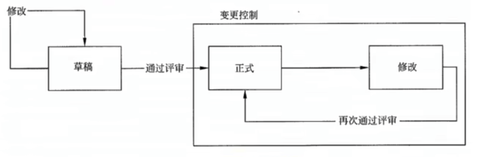
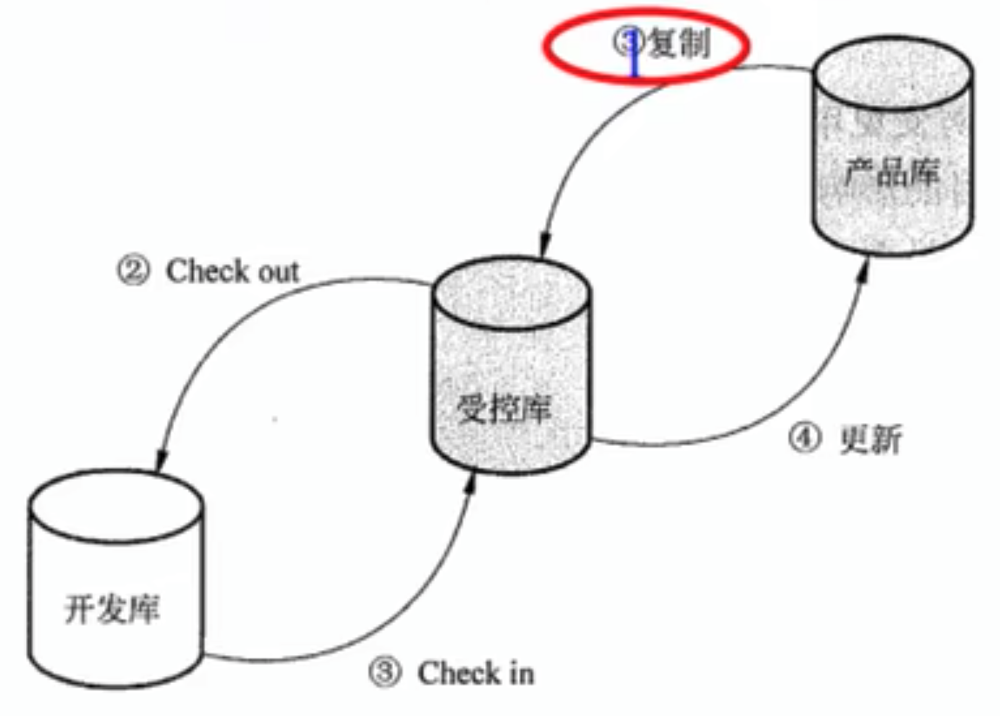

# 信息（文档）和配置管理

软件文档分为三类：

- **开发文档**。描述开发过程本身
- **产品文档**。开发过程等产物
- **管理文档**。记录项目管理等信息

文档的质量分为四级：

1. 最低限度文档（1 级文档）。适合开发工作量低于一个人月的开发者自用程序。
2. 内部文档（2 级文档）。可用于没有与其他用户共享资源的专用程序。
3. 工作文档（3 级文档）。同一单位内若干人联合开发的程序，或可被其他单位使用的程序。
4. 正式文档（4 级文档）。适合那些要正式发行供普通使用的软件产品。

信息系统文档的规范化管理主要体现在文档书写规范、图表编号规则、文档目录编写标准和文档管理制度等。

配置管理是为了系统控制配置变更，在系统的整个生命周期中维持配置的完整性和可追踪性，二标识系统在不同时间点上配置的学科。

> GB/T 11457-2006 中配置管理的定义：
> 应用技术的管理的指导和监控方法以标识和说明配置项的功能和物理特征，
> 控制这些特征的变更，记录和报告变更处理和实现状态并验证与规定的需求的遵循性。

主要活动：

1. 制定配置管理计划
2. 配置标识
3. 配置控制
4. 配置状态报告
5. 配置审计
6. 发布管理和交付

> GB/T 11457-2006 中配置项的定义：
> 为配置管理设计的硬件、软件或二者的集合，在配置管理过程中作为一个单个实体来对待

典型配置项：

1. 项目计划书
2. 需求文档
3. 设计文档
4. 源代码
5. 可执行代码
6. 测试用例
7. 软件运行所需的各种数据

配置项分类：

- 基线配置项。可能包括所有的设计文档和源程序
- 非基线配置项。各类计划和报告

所有配置的操作权限应该由 CMO（配置管理员）严格管理。
基本原则是：基线配置项开发人员开放读取的权限；非基线配置项向 PM、CCB 及相关人员开放。

配置项状态：

1. 草稿
2. 正式
3. 修改

配置项的版本号

1. 草稿阶段。0.YZ。
2. 正式阶段。X.Y。第一次成为“正式”文件的版本号为 `1.0`
3. 修改阶段。X.YZ

在项目开发过程中，绝大部份的配置项都要经过多次的修改才能最终确定下来。
对配置项的任何修改都将产生新的版本。
因为不能保证新版比旧版本要好，所以不能抛弃旧版本。

配置极限由一组配置项组成，这些配置项构成一个相对稳定的逻辑实体。
不能随意修改，必须进行变更控制流程。

配置库分类：

1. 开发库。动态库、程序员库或工作库。
2. 受控库。主库，某个阶段结束时，将当前工作产品存入受控库。
3. 产品库。静态库、发行库，完成测试后，作为最终产品存入该库。

配置控制委员会（Configuration Control Board，CCB），
负责对配置变更做出评估、审批及监督已批准变更的实施。
不是常设机构，可以根据需要组成。

配置管理员（Configuration Management Officer，CMO），负责在项目的整个生命周期中进行撇脂管理活动：

1. 编写配置管理计划
2. 建立和维护配置管理系统
3. 建立和维护配置库
4. 配置项识别
5. 建立和管理基线
6. 版本管理和配置控制
7. 配置状态报告
8. 配置审计
9. 发布管理和交付
10. 对项目成员进行配置管理培训

配置管理计划，是配置管理过程的基础，应该形成文件并在整个项目生命周期内处于受控状态。
配置控制委员会负责审批改计划。

配置标识（Configuration Identification）也称配置标识别，
包括为系统选择配置项并在技术文档中记录配置项的功能和物理特征。

配置标识基本步骤：

1. 识别需要受控的配置项
2. 制定唯一标识
3. 定义每个配置项的重要特征
4. 确定每个配置项的所有者及其责任
5. 确定配置项进入配置管理的时间和条件
6. 建立和控制基线
7. 维护文档和组件的修订与产品版本之间的关系

配置控制的任务：

1. 标识和记录变更申请
2. 变更评估
3. 通告评估结果
4. 变更实施
5. 变更验证与确认
6. 变更的发布

配置状态报告（Configuration Status Reporting）也称配置状态统计（Configuration Status Accounting），
其任务是有效地记录和报告管理配置所需的信息。
目的是及时准确的给出配置项的当前状况，供相关人员了解，以加强配置管理

配置审计（Configuration Audit）也称为配置审核或配置评价，包括功能配置审计和物理配置审计，分别用以验证当前配置项的一致性和完整性。

功能配置审计（Functional Configuration Audit）是审计配置项的一致性。

物理配置审计（Physical Configuration Audit）是审计配置项的完整性。

发布管理和交付活动的主要任务是：
有效控制软件产品和文档的发行和交付，在软件产品的生存期内妥善保存代码和文档的母拷贝。
