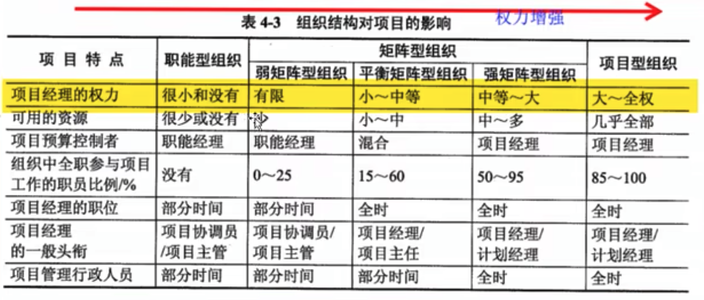
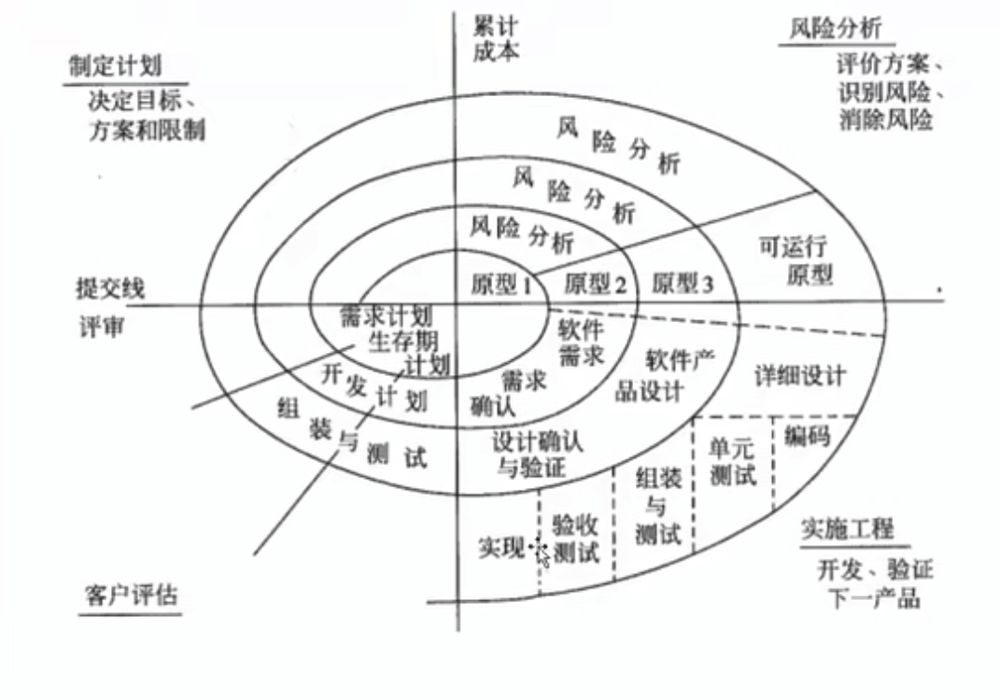
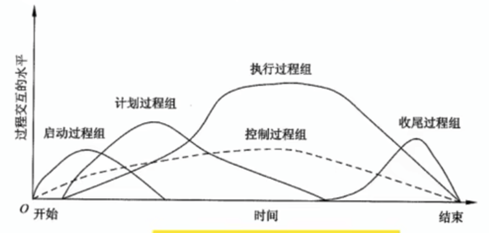

# 项目管理一般知识

## 项目和项目管理

### 项目的定义

为达到特定目标，在一定时间内，用一定的资源，为特定发起人提供特殊的产品、服务或成果而进行的一系列活动的集合。

项目是为了创造独特产品、服务、成果而进行的临时性工作

### 项目的目标

成果性目标（项目目标）。
指通过项目开发出满足用户要求的产品、系统、服务或成果。

约束性目标（管理目标）。
完成成果性目标需要的时间、成本以及要求满足的质量。

项目目标的特性：

- 项目目标具有不同的优先级。不同目标在不同项目阶段，重要性不一致。
- 项目目标具有层次性

项目的目标要遵守 SMART 原则

- 具体的（Specific）
- 可测量的（Measurable）
- 可达到的（Attainable）
- 有相关性的（Relevant）
- 有明确时间限制的（Time-bound）

### 项目的特点

> 常考点

1. 临时性
2. 独特性
3. 渐进明细。项目成果性目标是逐步完成的。

### 信息系统集成项目的特点

1. 信息系统集成项目以满足客户和用户的需求为根本出发点。
2. 需求常常不够明确、复杂多变
3. 不是简单选择最好产品的行为
4. 高技术与高技术的集成
5. 系统工程。必要时应“一把手”原则
6. 项目成员年轻
7. 强调沟通的重要性

系统集成项目管理既是一种管理行为又是一种技术行为

### 项目管理的定义及其知识范围

所谓项目管理是指在项目活动中综合运用知识、技能、工具和技术在一定的时间、成本、质量等要求下来实现项目的成果性目标的一系列行为

时间、成本、质量为制约项目成功的三约束。
近些年的另一种观点是范围、时间、成本为三约束。
最新的观点是范围、时间、成本、质量 4 个方面的约束

### 项目管理需要的专业知识和技术

了解和使用以下知识

1. 项目管理知识体系 => 知识
2. 项目应用领域的知识、标准和规定 => 约定
3. 项目环境知识 => 落地环境
4. 通用的管理知识和技能 => 管理技能
5. 软技能或人际关系技能 => 软技能
6. 经验、知识、工具和技术 => 具体落地能力

软技能包括：

1. 有效沟通
2. 对组织施加影响
3. 领导能力
4. 激励
5. 谈判和冲突管理
6. 分析和综合归纳能力
7. 解决问题

### 项目管理学科的产生和发展

近代项目管理随着管理科学的发展而发展起来

1. 为了适应现代产品的创新速度
2. 适应全球化的经济结构

国际项目管理协会（International Project Management Association，IPMA）由英、法、德、俄罗斯、**中国**等多个国家的项目管理专业组织而成

项目管理资质标准（IPMA Competence Baseline，ICB） 的 28 个核心要素和 14 各附加要素

| 核心要素             |                  | 附加要素         |
| :------------------- | :--------------- | :--------------- |
| 项目和项目管理       | 资源             | 项目信息管理     |
| 项目管理的实施       | 项目费用与融资   | 标准和规范       |
| 按项目进行管理       | 技术状态与变化   | 问题解决         |
| 系统方法与综合       | 项目风险         | 项目后评价       |
| 项目背景             | 效果度量         | 项目监督与监控   |
| 项目阶段与生命期     | 项目控制         | 业务流程         |
| 项目开发与评估       | 信息、文档与报告 | 人力资源开发     |
| 项目目标与策略       | 项目组织         | 组织的学习       |
| 项目成功与失败的标准 | 团队工作         | 变更管理         |
| 项目启动             | 领导             | 项目投资体制     |
| 项目收尾             | 沟通             | 系统管理         |
| 项目结构             | 冲突与危机       | 安全、健康与环境 |
| 范围与内容           | 采购与合同       | 法律与法规       |
| 时间进度             | 项目质量管理     | 财务与会计       |

国际项目管理专业资质认证（International Project Management Professional，IPMP） 四个等级：

- A 级。高级项目经理
- B 级。项目经理
- C 级。一般从业人员
- D 级。助理

美国项目管理学会（Project Management Institute，，PMI）致力于向全球推行项目管理的理论和方法，是目前最大的全球性项目管理专业组织

项目管理知识体系（Project Management Body of Knowledge，PMBOK） 提出的项目管理知识体系
将项目管理分为 5 个过程组和 10 个知识领域

| 项目生命周期           | 过程组     | 10 大知识领域 |
| :--------------------- | :--------- | :------------ |
| 项目生命周期           | 启动过程组 | 整体管理      |
| 项目生命周期各个阶段   | 计划过程组 | 范围管理      |
| 阶段内和阶段之间的过程 | 执行过程组 | 时间管理      |
|                        | 监控过程组 | 成本管理      |
|                        | 收尾过程组 | 质量管理      |
|                        |            | 人力资源管理  |
|                        |            | 沟通管理      |
|                        |            | 采购管理      |
|                        |            | 风险管理      |
|                        |            | 干系人管理    |

信息产业部（工业和信息化部）正在大力推进信息系统项目管理

### 项目经理应具备的技能和素质

合格的项目经理，至少具备以下素质

1. 足够的知识
2. 丰富的项目管理经验
3. 良好的协调和沟通能力
4. 良好的职业道德
5. 一定的领导和管理能力

优秀的项目经理

1. 真正理解项目经理角色
2. 领导并管理项目团队
3. 依据项目进展的阶段，组织制定详细程度适宜的项目计划
4. 理解“一把手工程”
5. 注重客户与用户参与（重视相关干系人参与）

### 项目干系人

项目干系人指积极参与项目，或是利益受项目执行的影响，或是其利益会受到项目结果影响的个人和组织，他们可能会对项目及其结果施加影响。

关键干系人

- 客户
- 用户
- 项目经理
- 执行组织
- 项目团队及其成员
- 项目发起人。为项目分配资源的个人或组织
- 职能经理。在一个单位内，职能经理能够为项目经理提供及时和合格的资源
- 影响者。不直接购买或使用项目产品的个人或团体，但其在客户组织内的地位可能正面或负面地影响项目的进程。
- 项目管理办公室。

**项目经理必须管理项目干系人的期望**，干系人之间往往存在目标冲突

### 项目管理系统

项目管理系统指用于管理项目的工具、技术、方法、资源和过程组之集合。

项目管理系统（正式或非正式的）有助于项目经理有效地控制项目顺利完成。

### 事业环境因素

在项目启动时，必须考虑涉及并影响项目成功的环境、组织的因素和系统。
这些因素和系统可能促进项目也可能阻碍项目。
环境因素很难改变，比如在 2021 年推动 k12 互联网教育。

1. 实施单位的企业文化和组织结构
2. 国家和行业标准
3. 现有的设施和固定资产
4. 实施单位现有的人力资源、人员的专业和技能，人力资源管理政策（招聘、解聘的指导方针）、员工绩效评估和培训记录等
5. 市场行情
6. 项目干系人的风险承受能力
7. 行业数据库
8. 项目管理信息工具

### 组织过程资产

1. 组织中指导工作的过程和程序
   1. 组织的标准过程
   2. 标准指导方针、工作指南等
   3. 满足特定需求的标准过程的修正值呢喃
   4. 。。。
2. 组织的全部知识
   1. 项目文档
   2. 过程测量数据库
   3. 经验学习系统
   4. 问题和缺陷管理数据库
   5. 配置管理知识哭
   6. 财务数据库

## 项目的组织方式

### 组织体系

### 组织的文化、风格与沟通

### 组织结构

组织结构分类:

- 职能型组织。
  优点：

  - 强大的技术支持，便于知识、技能和经验交流
  - 清晰的职业生涯晋升路线
  - 直线沟通、交流简单、责任和权限清晰
  - 有利于重复性工作为主的过程管理

  缺点：

  - 职能利益大于项目利益，具有狭隘性
  - 组织横向之间的联系薄弱
  - 部门间沟通协调难度大
  - 项目经理缺少权利、权威
  - 项目管理发展方向不明确

- 矩阵型组织。
  分类：

  - 弱矩阵型组织。
  - 平衡矩阵型组织。
  - 强矩阵型组织。

  优点：

  - 项目经理负责制，有明确的项目目标
  - 改善了项目经理对整体资源的控制
  - 及时响应
  - 获得职能组织更多的支持
  - 最大限度地利用公司的稀缺资源
  - 降低了跨职能部门间的协调合作难度
  - 使质量、成本、时间、范围制约因素得到更好的平衡
  - 团队成员有归属感
  - 出现的冲突较少，且容易处理解决

  缺点：

  - 管理成本增加；
  - 多头领导
  - 难以检测和控制
  - 资源分配与项目优先问题产生冲突
  - 权利难以平衡

- 项目型组织
  优点：

  - 结构单一、权责分明、利于统一管理
  - 目标明确单一
  - 沟通简介
  - 决策快

  缺点：

  - 管理成本高
  - 项目环境封闭，不利于技术知识分享；
  - 缺乏事业上的连续性和保障

- 复合型组织。或多或少包含上诉三种组织形式

组织结构对项目的影响

### PMO 在组织结构中的作用

可以根据需要为一个项目、一个部门或一个企业设立 PMO。
三个级别的 PMO 可以同时存在

项目管理办公室（PMO）的关键特征：

- 在所有 PMO 管理的项目之间共享和协调资源
- 明确制定项目管理方法、最佳实践和标准
- 负责制定项目方针、流程、模版和其他共享资料
- 为所有项目进行集中的配置管理
- 对所有项目的集中的共同风险和独特风险存储库加以管理
- 项目工具的实施和管理中心
- 项目之间的沟通管理协调中心
- 对项目经理进行指导的平台
- 通常对所有 PMO 管理的项目的时间基线和预算进行集中监控
- 在项目经理和任何内部或外部的质量人员或标准化组织之间协调整体项目的质量标准

PMO 的三种类型：

- 支持型。PMO 担当顾问角色，向项目提供模版、最佳实践、培训，以及来自其他项目的信息和经验教训。对项目的控制程度很低。
- 控制型。不仅提供支持，而且通过各种手段要求项目服从 PMO 的管理策略。控制程度属于中等。
- 指令型。直接管理和控制项目。这种类型 PMO 对项目的控制程度非常高。

## 项目生命周期

### 项目生命周期的特征

在初始阶段，成本和人员投入水平较低。在中间阶段达到最高，当项目结束时快速下降。

在项目的初始阶段，项目干系人影响项目的最终产品特征和项目最终费用的能力最高，随着项目的持续开展逐渐变低。
其原因是随着项目的开展，需求变更和缺陷修复的成本会增加。

### 项目阶段的特征

每个项目阶段都以一个或一个以上的可交付物的完成为标志，这种可交付物是一种可度量、可验证的工作成果。

项目阶段的结束前，一般要对完成的工作和可交付物进行技术或设计评审，根据评审结果，以决定是否接受，是否还要做额外的工作或是否要结束这个阶段。

### 项目生命周期与产品生命周期的关系

产品的生命周期比项目生命周期更长。

## 典型的信息系统项目的生命周期模型

> 重点考点

### 瀑布模型

瀑布模型是一个经典的结构化的软件生命周期模型，也叫预测型生命周期、完全计划驱动型生命周期。

该模型，正在项目生命周期的尽早时间，要确定项目范围及交付此范围所需的时间和成本。

1. 定义阶段
   1. 计划
2. 开发阶段
   1. 需求分析
   2. 概要设计及详细设计
   3. 编码
   4. 测试
3. 维护阶段
   1. 运行
   2. 维护

瀑布模型的特点：

1. 从上一项开发活动接受其成果作为本次活动的输入
2. 利用这一输入，实施本次活动应完成的工作内容
3. 给出本次活动的工作成果，最为下一项活动的输入
4. 对本次活动的实施工作成果进行评审。
   如果成果得到确认，则进行下一活动。
   如果未确认返回前一项、甚至更前项活动。

缺点：中间过程的变更成本极高，无法适应频繁变更的需求。

### 迭代模型

每一个阶段都执行一次传统的、完整的穿行过程串，执行一次过程串就是一次迭代。。每次迭代涉及的过程都包括不同比例的所有活动。

软件统一过程（Rational Unified Process， RUP）是一种“过程方法” 是迭代模型一种

RUP 的四个阶段

- 初始阶段。系统地概述项目的范围，选择可行的系统架构、计划和准备业务案例。
- 细化阶段。细化构想，细化过程和基础设施，细化架构并选择构建。
- 构建阶段。资源管理、控制或过程优化，完成构件的开发并依评价标准进行测试，依构想的验收标准评估产品的发布。
- 交付阶段。同步并使并发的构造增量集成到一只的实施基线中，与实施有关的工程活动，根据完整的狗西藏和需求集的验收标准评估实施基线

### 敏捷开发

一种以人为核心、迭代、循序渐进的开发方法。

适用于以下场景：

- 一开始缺失完整需求和范围的项目
- 应对快速变化的环境
- 需求范围难以实现确定
- 以有利于于干系人的方式定义较小的增量改进

### V 模型

> 必考考点

V 模型左侧是开发过程各个阶段，右侧是测试的各个阶段。

V 墨香明确的标明测试过程中不同级别，并且清晰描述了测试阶段于开发各个阶段对应的关系。

- 验收测试 -> 需求分析
- 概要设计 -> 系统测试
- 详细设计 -> 集成测试
- 编码 -> 单元测试

V 模型也是过程模型的一种

### W 模型

V 模型的改进，测试整体活动开始时间提前，测试不需要完全等到开发过程完全结束

### 原型模型

1. 创建快速原型，满足项目干系人与未来的用户可以与原型进行交互
2. 通过与相关干系人充分讨论和分析，最终清楚当前系统的需求
3. 在原型的基础上开发出用户满意的产品

### 螺旋模型

螺旋模型是一个烟花软件过程模型，将原型实现的迭代特征与过程（瀑布）模型中的控制和系统化方面结合起来。
**强调风险分析和管理。**适用于庞大、复杂、高风险项目。

开发过程具有周期性重复的螺旋线状。

螺旋模型的四个阶段：

- 制定计划
- 风险分析
- 实施工程
- 客户评估

## 单个项目管理过程

### 项目过程

过程就是一组为了完成一系列事先指定的产品、成果或服务而需执行的互相联系的行动和活动。

管理好项目至少需要以下 4 种过程。

1. 技术类过程
2. 管理类过程
3. 支持类过程
4. 改进类过程

PDCA 循环 （Plan-Do-Check-Act cycle），一种关于项目管理过程交互的根本概念。

- 上一个 PDCA
- 当前 PDCA
  - Plan。行动之前必计划
  - Do。根据计划行动
  - Check。检查行动结果
  - Act。改进
- 下一个 PDCA

### 项目管理过程组

1. 启动过程组。
2. 计划编制过程组。
3. 执行过程组。
4. 监督与控制过程组。要求定期测量和监控进展、
5. 收尾过程组。正式接受产品、服务或工作成果。

项目获阶段收尾时，可能需要进行以下工作

1. 获得客户或发起人的验收，以证实结束项目或阶段
2. 进行项目后评价或阶段结束评价
3. 记录裁剪任何过程的影响
4. 记录经验教训
5. 对组织过程资产进行适当更新
6. 将所有相关项目文件在项目管理信息系统中归档，以便作为历史数据使用
7. 结束所有采购活动，确保说有相关协议的完结
8. 对项目成员进行评估，释放项目资源

现实中数据和信息经常交替使用，这会导致各项目干系人的困惑和误解。

1. 工作绩效数据。在执行项目工作的过程中，从每个正在执行的活动中收集到的原始观察结果和测量值。
   例如，工作完成百分比、进度活动的开始和结束日期、变更请求的数量等
2. 工作绩效信息。从各控制过程中收集并结合相关背景和跨领域关系，进行整合而得到的绩效数据。（CV，SV，CPI，SPI）
   例如，进度绩效指数 < 1
3. 工作绩效报告。为制定决策、提出问题、采取行动或引起关注，而会变工作绩效信息所形成的事务或电子项目文件。

### 项目管理过程图示

> 重点考点

5 个管理过程组和项目管理知识领域映射关系。

TODO
