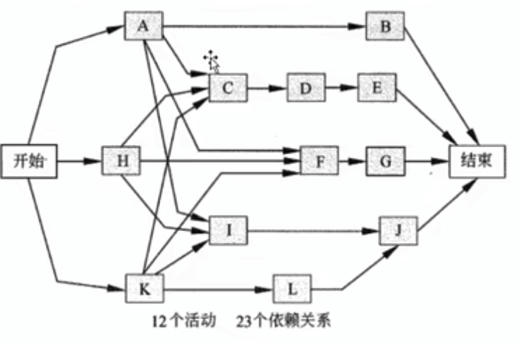
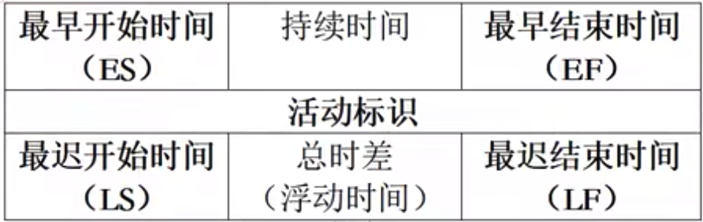
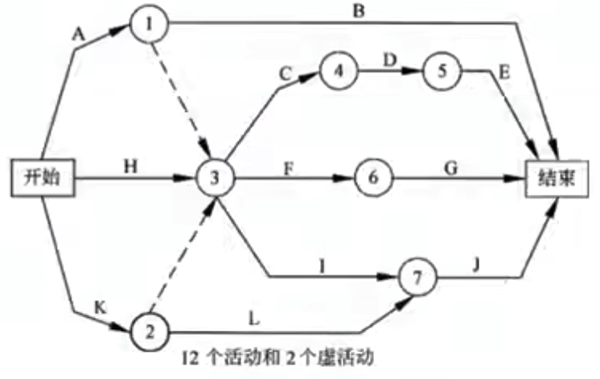
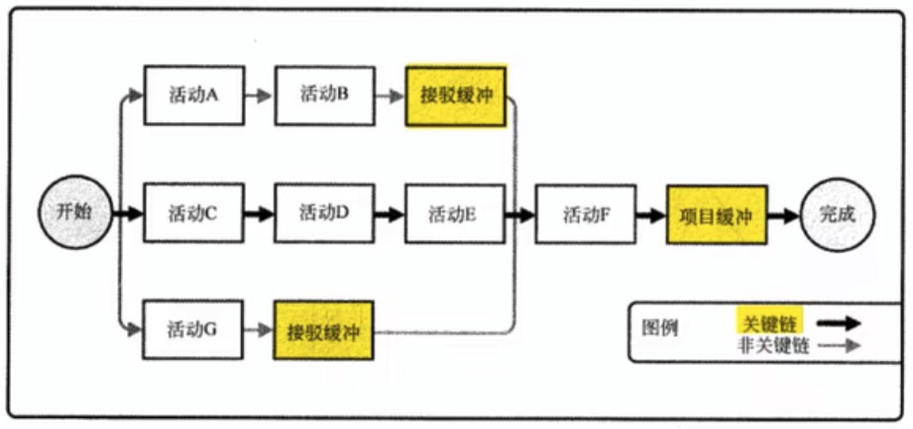
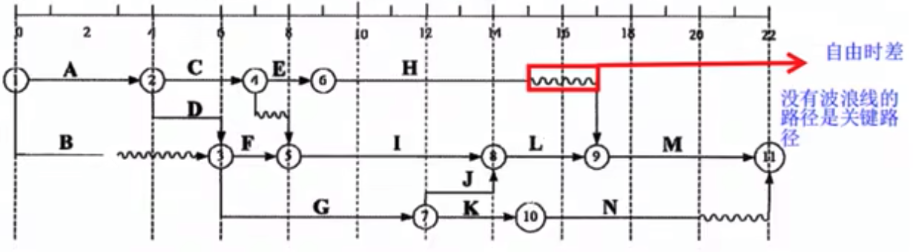

# 项目进度管理

包括为管理项目按时完成所需的 7 个过程：

1. 规划进度管理过程。制定政策、程序和文档以管理项目进度。
2. 定义活动过程。识别和记录为完成项目可交付成果而需采取的具体行动。
3. 排列活动顺序过程。识别和记录项目活动之间的关系。
4. 估算活动资源过程。估算执行各项活动所需材料、人员、设备或用品的种类和数量。
5. 估算活动持续时间过程。根据资源估算的结果，估算完成单项活动所需工期。
6. 制定进度计划过程。分析活动顺序、持续时间、资源需求和进度制约因素，创建项目进度模型。
7. 控制进度过程。监督项目活动状态、更新项目进展、管理进度基准变更，以实现计划。

## 规划进度管理

规划项目进度管理是为实施项目进度管理制定政策、程序，并形成文档化的项目进度管理计划的过程。

**项目进度管理计划是项目管理计划的组成部分。**

根据需要，进度管理计划可以是正式或非正式的，高度概括的或非常详细的。

### 规划进度管理的输入

1. 项目管理计划
   1. 范围基准
   2. 其他信息
2. 项目章程
3. 组织过程资产
   1. 可用的监督和报告工具
   2. 历史信息
   3. 进度控制工具
   4. 现有的、正式和非正式的、与进度控制有关的政策、程序和指南
   5. 模版
   6. 项目收尾指南
   7. 变更控制工具
   8. 风险控制程序，包括风险类别、概率定义与影响，以及概率和影响矩阵
4. 事业环境因素
   1. 能影响进度管理的组织文化和结构
   2. 可能影响进度规划的资源可用性和技能
   3. 提供进度规划工具的项目管理软件
   4. 发布的商业信息
   5. 组织中的工作授权系统

### 规划进度管理的工具与技术

1. 专家判断
2. 分析技术
3. 会议

### 规划进度管理的输出

1. 项目管理计划
   1. 项目进度模型制定。
   2. 准确度。需要规定活动持续时间估算的可接受区间，以及允许的应急储备数量
   3. 计量单位。
   4. 组织程序连接。
   5. 项目进度模型维护。在项目执行期间如何在进度模型中更新项目状态，记录项目进展。
   6. 控制临界值。
   7. 绩效测量规则。规定用于绩效测量的挣值管理规则或其他测量规则。
   8. 报告格式。
   9. 过程描述。

## 定义活动

工作包通常还应进一步细分为更小的组成部分，即“活动”。
活动就是为了完成工作包所需进行的工作，是实施项目时安排工作的最基本的工作单元。

活动于工作包是 1 对 1 或多对 1 对关系，即有可能多个活动完成一个工作包

定义活动过程就是识别和记录为完成项目可交付成果而需采取的所有活动。

### 定义活动的输入

1. 进度管理计划
2. 范围基准
3. 组织过程资产
   1. 经验教训知识库。
   2. 标准化的流程
   3. 来自以往项目的、包含标准活动清单或部分活动清单的模版
   4. 现有的、正式和非正式的、与活动规划相关的政策、程序和指南
4. 事业环境因素
   1. 组织文化和结构
   2. 商业数据库中发布的商业信息
   3. 项目管理信息系统

### 定义活动的工具与技术

1. 分解。WBS、WBS 词典和活动清单可以一次或同时编制，其中 WBS、WBS 词典是制定最终活动清单的基础
2. 滚动式规划。
3. 专家判断。

**滚动式规划**是一种迭代式规划技术，即近期要完成的工作在工作分解结构最下层详细规划，而计划在远期完成的工作，在工作分解结构较高层粗略规划。
因此，**在项目生命周期的不同阶段，项目活动的详细程度会有所不同。**

### 定义活动的输出

1. 活动清单。包含项目所需的全部活动的综合清单。
2. 活动属性。活动描述的扩展
3. 里程碑清单。项目中重要的时间点或事件。

## 排列活动顺序

排列活动顺序是**识别和记录项目活动之间的关系的过程**。
主要作用是，定义工作之间的逻辑顺序，以便在既定的所有项目制约因素下**获得最高的效率**。

### 排列活动顺序的输入

1. 进度管理计划。规定了用于项目进度规划方法和工具。
2. 活动清单
3. 活动属性。例如活动之间的必然顺序或确定的紧前紧后工作。
4. 里程碑清单
5. 项目范围说明书
6. 事业环境因素
   1. 政府或行业标准
   2. 项目管理信息系统（PMIS）
   3. 进度规划工具
   4. 公司的工作授权系统
7. 组织过程资产
   1. 公司知识库中有助于确定进度规划方法了的项目档案
   2. 现有的、正式和非正式的、与活动规划有关的政策、程序和指南
   3. 有主语加快项目活动网络图编制的各种模版。

### 排列活动顺序的工具与技术

1. 前导图法（Precedence Diagramming Method，PDM），也称紧前关系绘图法。
2. 箭线图法（Arrow Diagramming Method，ADM）。
3. 确定依赖关系。
   1. 强制依赖
   2. 选择性依赖
   3. 外部依赖
   4. 内部依赖
4. 提前量与滞后量。

#### 前导图法

> 计算题重点考点

前导图法节点代表活动，节点间用箭头连接，以显示节点间逻辑关系。
也称作单代号网络图或活动节点图（Active On Node，AON），为大多数项目管理软件所采用。



前导图法存在 4 种类型依赖关系：

1. 结束-开始（F-S 型）
2. 结束-结束（F-F 型）
3. 开始-开始（S-S 型）
4. 开始-结束（S-F 型）

通常每个节点的活动会有以下几个时间。

- 最早开始时间（Earliest Start time，ES）
- 工期
- 最早完成时间 （Earliest Finish time，EF）
- 最迟开始时间（Latest Start time，LS）
- 总浮动时间。`总浮动时间=LS - ES=LF - EF`
- 最迟完成时间 （Latest Finish time，LF）



```
自由时差=min(紧后工作的 ES - 此活动的 EF)
```

#### 箭线图法

> 计算题重点考点

箭线图法用箭线表示活动、**节点表示事件**的一种网络图绘制方法。
也被称作双代号网络图或活动箭线图（Active On the Arrow，AOA）



活动开始（箭尾）事件叫做该活动的紧前事件（precede event），活动的结束（箭头）事件叫该活动的紧后事件（successor event）。

3 个基本原则：

1. 网络图中每一活动和每一事件都必须有一个唯一的一个代号。
2. 任两项活动的紧前事件和紧后事件代号至少有一个不相同，**节点代号沿箭线方向越来越大**。
3. 流入（流出）统一节点的活动，均有共同的紧后活动（或紧前活动）。

为了绘图方便，一如来一种额外的特殊活动，叫虚活动（dummy activity），用虚箭线表示。
虚活动不消耗事件，也不消耗资源，知识为了弥补箭线图在表达活动依赖关系方面的不足。

### 排列活动顺序的输出

1. 项目进度网络图
2. 项目文件更新
   1. 活动清单
   2. 活动属性
   3. 里程碑清单
   4. 风险登记册

## 估算活动资源

估算活动资源是估算执行各活动所需的材料、人员、设备或用品的种类和数量的过程。
主要作用是，明确完成活动所需的资源种类、数量和特性，以便作出更准确的成本和持续时间估算。

估算活动资源过程与估算成本过程紧密相关。

### 估算活动资源的输入

1. 进度管理计划
2. 活动清单
3. 活动属性
4. 资源日历。表明每种具体资源的可用工作日或工作班次的日历。
5. 风险登记册
6. 活动成本估算
7. 事业环境因素
   1. 资源所在位置
   2. 资源可用性
   3. 人力资源的技能水平
   4. 等
8. 组织过程资产
   1. 关于人员配备的政策和程序
   2. 关于租用、购买用品和设备的政策与程序
   3. 关于遗忘项目中类似工作所使用的资源类型的历史信息

### 估算活动资源的工具和技术

1. 专家判断
2. 备选方案分析
3. 发布的估算数据
4. 项目管理软件
5. 自下而上估算。一种估算项目持续时间或成本的方法，通过从下到上逐层汇总 WBS 组件的估算而得到项目估算。

### 估算活动资源的输出

1. 活动资源需求。明确工作包中每个活动所需的资源类型和数量。
2. 资源分解结构（Resource Breakdown Structure，RBS）是资源依类别和类型的层级展现。
3. 项目文件更新
   1. 活动清单
   2. 活动属性
   3. 资源日历

## 估算活动持续时间

估算活动持续时间是根据资源估算的结果，估算完成单项活动所需工作时段数的过程。
主要作用是，确定完成每个活动所需花费的时间量，为制定进度计划过程提供主要输入。

估算活动持续时间依据的信息包括：

- 活动工作范围
- 所需资源类型
- 估算的资源数量和资源日历

### 估算活动持续时间的输入

1. 进度管理计划。规定了用于估算活动持续时间的方法和准确度，以及其他标准
2. 活动清单。
3. 活动属性。为每个活动的持续时间提供了主要输入。
4. 活动资源需求。估算的活动资源需求会对活动持续时间产生影响。
5. 资源日历。资源可用性、资源类型和性质都会影响活动的持续时间
6. 项目范围说明书。
   1. 假设条件
      - 现有条件
      - 信息的可用性
      - 报告期的长度
   2. 制约因素
      - 可用的熟练资源
      - 合同条款和要求
7. 风险等级测。
8. 资源分解结构。
9. 事业环境因素
   - 持续时间估算数据和其他参考数据
   - 生产率测量指标
   - 发布的商业信息
   - 团队成员所在地
10. 组织过程资产
    - 关于持续时间的历史信息
    - 项目日历
    - 进度规划方法论
    - 经验教训。

### 估算活动持续时间的工具与技术

1. 专家判断
2. 类比估算。使用相似活动或项目的历史数据来估算当前活动或项目的持续时间或成本的技术。
3. 参数估算。基于历史数据和项目参数，使用某种算法来计算成本或持续时间的估算技术。（典型 ETC 和 非典型 ETC）
4. 三点估算。
5. 群体创新技术和群体决策技术
6. 储备分析。

在进行持续时间估算时应考虑**应急储备**，并纳入项目进度计划。
应急储备包含在项目进度基准中。
同时可以估算项目所需的**管理储备**。

#### 三点估算

三点估算源自计划评审技术（ Program Evaluation And Review Technique， PERT）。

> 计算题考点

使用 3 种估算值界定活动持续时间的近似区间：

- 最可能时间(Tm)
- 最乐观时间(To)
- 最悲观时间(Tp)

```
期望持续时间(Te) = (最乐观时间 + 最悲观时间 + 4 * 最可能时间) / 6
标准差 = (最乐观时间 + 最悲观时间) / 6
```

- 1 标准差内概率为 68%
- 2 标准差内概率为 95%
- 3 标准差内概率为 99%

### 估算活动持续时间的输出

1. 活动持续时间估算
   - 两周 +/- 两天
   - 超过 3 周 85%
2. 项目文件更新
   1. 活动属性
   2. 为估算活动持续时间而制定的假设条件

## 制定进度计划

通过把填有项目数据的 进度规划工具看作进度模型，可以把项目进度的呈现形式与产生项目进度计划的进度数据和计算工具区分开来。
进度模型时项目活动执行计划的一种表示形式，其中包含持续时间】依赖关系和其他规划信息，用以生成项目进度计划及其他进度资料。

常见的进度规划方法有关键路径法（CPM）和关键链法（CCM）

制定可行的项目进度计划往往是一个反复进行的过程。

**经批准的最终进度计划将作为基准用于控制进度过程**。
随着项目活动的开展，项目时间管理的大部分工作都将发生在控制进度过程中，以确保项目工作按时完成。

### 制定进度计划的输入

1. 进度管理计划。
2. 活动清单。
3. 活动属性。
4. 项目进度网络图。
5. 活动资源需求。
6. 资源日历。
7. 活动持续时间估算。
8. 项目范围说明书。包含了会影响项目进度计划制定的假设条件和制约因素。
9. 风险等级册
10. 项目人员分配
11. 资源分解结构
12. 事业环境因素
    1. 标准
    2. 沟通渠道
    3. 用以创建进度模型的进度规划工具
13. 组织过程资产。例如，进度规划方法论和项目日历。

### 制定进度计划的工具和技术

1. 进度网络图
2. 关键路径法。
3. 关键链法
4. 资源优化技术
5. 建模技术
6. 提前量和滞后量。
7. 进度压缩
   1. 赶工
   2. 快速跟进。**增加并行开展，风险增大**
8. 进度计划编制工具

#### 关键路径法

> 计算题重点

关键路径法在不考虑任何资源限制的情况下，沿进度望路途路径顺推和逆推分析，计算出所有活动的最早开始、最早结束、最迟开始和最迟完成日期。

顺推：

1. 根据逻辑关系方向：从网络图始端向终端计算
2. 第一个活动的最早开始时间为项目最早开始时间，
3. 其余活动的最早开始时间为 `Max（紧前活动最早完成时间）`
4. `活动的最早完成时间 = 最早开始时间 + 活动的持续时间（工期）`

逆推：

1. 根据逻辑关系方向：从网络图终端向始端计算
2. 最后一个活动的最迟完成时间为项目最迟完成时间
3. 其余活动的最迟完成时间为 `Min（紧后活动的最迟开始时间）`
4. `活动的最迟开始时间 = 最迟完成时间 - 活动的持续时间`

关键路径是项目中时间最长的活动顺序。
决定了项目的最短时间。

关键路径法还可以计算进度模型中进度的灵活性大小。
在不延误项目完工时间且部违反制约因素的前提下，活动可以拖延的时间量，就是该活动的进度灵活性，被称为“总浮动时间”。

```
总浮动时间 = 最迟开始（LS） - 最早开始(ES) = 最迟完成(LF) - 最早完成(EF)
```

**一般情况，关键活动的总府东时间为 0**。

**自由浮动时间**是指在不延误任何紧后活动的最早开始时间且部违反进度制约因素的前提下，活动可以从最早开始时间推迟或拖延的时间量。

```
自由浮动时间 = min(紧后活动最早开始时间 - 本活动最早完成时间)
```

#### 关键链法

一种进度规划方法，允许项目团队在任何项目路径上设置缓冲，以应对不确定性。



放置在关键链末尾的称为**项目缓冲**。
其他缓冲，即接驳缓冲，则放置在非关键连与关键链的结合点，用来保护关键链不受非关键链延误 。

#### 资源优化技术

> 常考考点

- 资源平衡。未来在资源需求与资源供给之间取得平衡。**对开始日期和结束日期进行调整，但往往会改变关键路径，可能增加工期**
- 资源平滑。**不会改变关键路径，不延长工期，只在自由时间和总府东时间内延迟，但是可能会会增加资源投入**。

### 制定进度计划的输出

1. 进度基准。经过批准的项目进度计划
2. 项目进度计划
   1. 横道图（甘特图）
   2. 里程碑图
   3. 项目进度网络图
3. 进度数据
   1. 按时段计列的资源需求
   2. 备选的进度计划
   3. 进度应急储备
4. 项目日历
5. 项目管理计划更新
   1. 项目基准
   2. 进度管理计划
6. 项目文件更新
   1. 活动资源需求
   2. 活动属性
   3. 日历
   4. 风险登记册

#### 时标网络图

> 常考

包括时间刻度和表示活动持续时间的横条，以及活动弄之间的逻辑关系。



## 控制进度

控制进度是监督项目活动状态，更新项目进展，管理进度基准变更，以实现计划的过程。
主要作用是，提供发现计划偏离的方法，从而及时纠正和预防，以降低风险。

需要关注如下内容：

1. 项目进度的当前状态
2. 对引起进度变更的因素施加影响，以保证变化朝有利方向发展
3. 判断项目进度是否已经发生变更
4. 当变更实际发生时，严格按照变更控制流程对其进行管理。

通常可以采取以下方式缩短活动工期：

1. 赶工
2. 快速跟进
3. 使用高素质的资源或经验更丰富的人员
4. 减小活动范围或降低活动要求
5. 改进方法或技术
6. 加强质量管理

### 控制进度的输入

1. 项目管理计划。其中包含项目进度管理计划和进度基准。
2. 项目进度计划。
3. 工作绩效数据
4. 项目日历
5. 进度数据
6. 组织过程资产
   1. 现有的，正式和非正式的，与进度控制有关的政策、程序和指南
   2. 进度控制工具
   3. 可用的监督和报告工具

### 控制进度的工具与技术

1. 绩效审查
   1. 趋势分析
   2. 关键路径法
   3. 关键链法
   4. 挣值管理
2. 项目管理软件
3. 资源优化技术
4. 建模技术
5. 提前量和滞后量
6. 进度压缩
7. 进度计划编制工具

### 控制进度的输出

1. 工作绩效信息。针对 WBS 组件，计算出进度偏差（SV）和进度绩效指数（SPI）
2. 进度预测
3. 变更请求
4. 项目管理计划更新
   1. 进度基准
   2. 进度管理计划
   3. 成本基准
5. 项目文件更新
   1. 进度数据
   2. 项目进度计划
   3. 风险登记册
6. 组织过程资产更新
   1. 偏差的原因
   2. 采取的纠正措施及理由
   3. 从项目进度控制管理中得到其他经验教训
