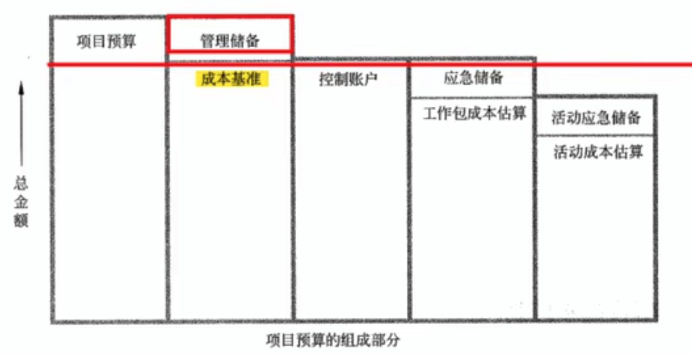
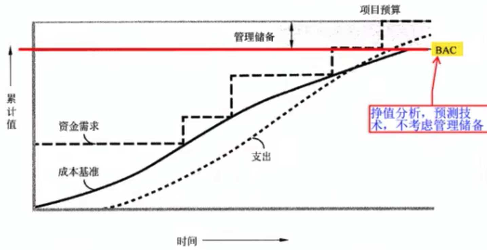

# 项目成本管理

成本指项目活动或其组成部分的**货币价值或价格**。

具体成本一般包括：

- 直接工时
- 间接工时
- 其他直接费用
- 其他间接费用
- 以及采购价格

项目全过程所耗用的各种成本的总和为项目成本。

项目管理受范围、时间、成本和质量的约束，
项目成本管理就是要确保**在批准的预算内完成项目**。

项目成本管理的过程：

1. 制定成本管理计划。制定了项目今成本结构、估算、预算和控制的标准。
2. 项目成本估算。编制完成项目活动所需资源的大致成本。
3. 项目成本预算。合计各个活动或工作包的估算成本，以建立**成本基准**。
4. 项目成本控制。影响造成成本偏差的因素，控制项目预算的变更。

产品的全生命周期成本就是在产品或系统的整个使用生命周期内，在获得阶段、运营及维护、以及消亡时的处置所发生的全部成本。

成本类型：

- 可变成本。随着生产量、工作量或时间而变的成本为可变成本。例如，制造产品的原材料。
- 固定成本。不随着生产量、工作量或时间的变化而变化的非重复成本。例如，制造产品的机器。
- 直接成本。直接可以归属于项目工作的成本。例如，工资、差旅费。
- 间接成本。来自一般管理费用科目或几个项目共同担负的项目成本所分摊给本项目的费用，就形成了项目的间接成本。如、税金、额外福利。
- 机会成本。利用一定的时间或资源生产的一种商品时，而失去的利用这些资源生产其他最佳替代品的机会就是机会成本。买彩票（利弊都有）
- 沉默成本。过去的决策已经发生了的，而且不能由现在和将来的任何决策改变的成本。

**应急成本属于成本基准内的一部分预算**。应对“已知-未知”风险。

管理成本不属于成本基准内的预算，是为了管理控制的目的而特别流出的项目预算。应对“未知-未知”风险。

**成本基准是经批准的按时间安排的成本支出计划**，并随时反映了经批准的项目成本变更，被用于度量和监督项目的实际执行成本。

## 制定项目成本管理计划

制定项目成本管理计划是**编制项目整体管理计划过程的一部分**。
一般在项目生命周期定义过程中对此进行选择，并在成本管理计划中加以记录。

成本管理计划可以是正式的、非正式的、详细的或概括性的。

制定成本管理计划的工作在项目计划阶段的**早期**进行，并为每个成本管理过程设定了框架，以便确保过程实施的协调一致和高效率

### 制定项目成本管理计划的输入

1. 项目管理计划
   - 范围基准
   - 进度基准
   - 其他项目管理计划中于成本相关的进度、风险和沟通决策。
2. 项目章程
3. 事业环境因素
   - 能影响成本管理的组织文化和组织结构
   - 市场条件
   - 货币汇率
   - 发布的商业信息
   - 项目管理信息系统
4. 组织过程资产
   - 财务控制程序
   - 历史信息和经验教训知识库
   - 财务数据库
   - 现有的、正式的和非正式的、与成本估算和预算有关的政策、程序和指南

### 制定项目成本管理计划的工具和技术

1. 专家判断
2. 分析技术。投资回收期、投资回报率、内部报酬率、现金流贴现和净现值
3. 会议。参会人员可能过包括项目经理、项目发起人、选定的项目团队成员、选定的干系人、项目成本负责人等

### 制定项目成本管理计划的输出

1. 成本管理计划。成本管理计划是整体项目管理计划的一部分。
   - 精确登记
   - 测量单位
   - 组织程序链
   - 控制临界值
   - 挣值规则
   - 报告格式
   - 过程说明
   - 其他细节。

## 项目成本估算

估算活动的成本，涉及估算完成每项活动所需资源的近似成本。
估算成本时，需要考虑成本估算偏差的可能原因（包括风险）。

随着项目的推进，可对成本估算进行细化，以反映额外的详细细节。
**项目估算的准确性随着项目的进展而提高**。

除了项目直接成本外，还需要考虑

- 非直接成本
- 学习曲线。_成员掌握新技术的上手难度_
- 项目完成时限
- 质量要求。质量与成本基本上呈正比关系。
- 储备。包括应急储备和管理储备。

估算的主要步骤

1. 识别病分析成本的构成科目
2. 根据以识别的项目成本构成科目，估算每一科目的成本大小
3. 分析成本估算结果，找出各种可以互相替代的成本，协调各种成本之间的比例关系。

### 项目成本估算的输入

1. 成本管理计划
2. 人力资源管理计划
3. 范围基准
   1. 范围基准
   2. WBS
   3. WBS 词典
4. 项目进度计划
5. 风险登记册
6. 事业环境因素
   1. 市场条件
   2. 发布的商业信息
7. 组织过程资产
   1. 成本估算政策
   2. 成本估算模版
   3. 历史信息
   4. 经验教训

### 项目成本估算的工具和技术

1. 专家判断
2. 类比估算。
   成本较低、耗时较少，但准确性也低。可以整体或部分进行类比估算
3. 参数估算
4. 自下而上的估算
5. 三点估算。类似进度估算中的三点估算
6. 储备分析
7. 质量成本（COQ）
8. 项目管理软件
9. 卖方投标分析
10. 群体创新和群体决策技术

### 项目成本估算的输出

1. 活动成本估算
2. 估算依据
   1. 关于估算依据的文件
   2. 关于全部假设条件的文件
   3. 关于各种已知制约因素的文件
   4. 对于估算区间的说明
   5. 对最终估算的置信水平说明
3. 项目文件更新

## 项目成本预算

成本预算指将单个活动或工作包的估算成本汇总，以确立衡量项目绩效情况的总体成本基准。

如果先得到成本估算，则成本预算时在项目成本估算的基础上，更精确的估算项目总成本。

项目成本预算的特征：

1. 计划性。在项目计划中，尽量精确地将费用分配到 WBS 的每一个组成部分，从而形成与 WBS 相同的系统结构。
2. 约束性。指预算分配的结果可能并不能满足所涉及的管理人员的利益要求，而表现为一种约束。
3. 控制性。项目预算的实质就是

编制项目成本预算的原则：

1. 项目成本预算要以项目需求为基础
2. 项目成本预算要与项目目标相联系，必须同时考虑项目质量和进度等目标
3. 项目成本预算要切实可行
4. 项目成本预算应当留有弹性

**制定项目成本预算的步骤：**

1. 将项目总成本分摊到项目工作分解结构的各个工作包。分解按自顶向下，根据占用资源数量多少而设置不同的分解权重。
2. 将各个工作包成本再分配到该工作包所包含的各项活动上。
3. 确定各项成本预算支出的时间计划及项目成本预算计划

根据资源投入时间段形成成本预算计划。

项目成本预算为衡量项目绩效情况提供了基准。

### 项目成本预算的输入

1. 成本管理计划
2. 范围基准
3. 活动成本估算
4. 估算依据
5. 项目进度计划
6. 资源日历
7. 风险登记册
8. 协议
9. 组织过程资产
   1. 成本预算工具
   2. 报告方法
   3. 现有的，正式的和非正式、与成本预算有关的政策、程序和指南

### 项目成本预算的工具和技术

1. 成本汇总
2. 储备分析
3. 专家判断
4. 历史关系
5. 资金限制平衡。“均衡的支出”。
   根据对项目资金的任何限制来平衡资金支出，出现不平衡时需要调整进度计划，以平衡资金支出水平。

### 项目成本预算的输出

1. 成本基准。
   经过批准的、按时间段分配的项目预算。是不同进度活动经批准的预算的总和。
   不包括管理储备，必须通过正式的变更程序才能变更，用作与实际结果进行比较的依据。
2. 项目资金要求。根据成本基准，确定总资金需求和阶段型资金需求。
3. 项目文件更新。





## 项目成本控制

项目成本控制内容：

1. 对造成成本基准变更的因素施加影响
2. 确保所有变更请求都得到及时处理
3. 当变更实际发生时，管理哲学变更
4. 确保成本支出不超过经批准的资金险恶，即不超出按时段、按 WBS 组件、按活动分配的险恶，也不超出项目总限额
5. 监督成本绩效，找出并分析与成本基准见的偏差
6. 对照资金支出，监督工作绩效
7. 防止在成本或资源使用报告中出现未经批准的变更
8. 相由关干系人报告所有经批准的变更及其相关成本
9. 设法把预期的成本超支控制在可接受的范围内

### 项目成本控制的输入

1. 项目管理计划
   1. 成本基准
   2. 成本管理计划
2. 项目资金需求
3. 工作绩效数据
4. 组织过程资产

### 项目成本控制的工具和技术

1. 挣值管理。（EVM）
2. 预测
3. 完工尚需绩效指数（TCPI）
4. 绩效审查
5. 项目管理软件
6. 储备分析

#### 挣值管理

> 重点考点

挣值管理是把范围、进度和资源绩效综合起来考虑，以评估项目绩效和进度的**绩效测方法**。

3 个关键指标：

- **计划值（Planned Value，PV）**，为计划工作分配的经批准的预算。
  不包括管理储备。
  在某个给定时间点，PV 代表应该已经完成的工作。
  PV 的总和有时被称为绩效测量基准（PMV），项目的总计划值又被称为**完工预算（BAC）**
- **挣值（Earned Value，EV）**，已完成工作的测量值，用分配给该工作的预算来表示。
  已完成工作经批准的预算。
- **实际成本（Actual Cost，AC）**，给定时间内，执行某工作而实际发生的成本。
  为完成与 EV 相对应工作而发生的总成本。
  AC 没有上限。

PV，EV，AC 的计算口径需要保持一致。

实际绩效与基准之间的偏差指标：

- **进度偏差（Schedule Variance，SV）**。`SV=EV-PV`
- **成本偏差（Cost Variance，CV）**。`CV=EV-AC`
- **进度绩效指数（Schedule Performance Index，SPI）**。`SPI=EV/PV`
- **成本偏差指数（Cost Performance Index，CPI）**。`CPI=EV/AC`

项目预测指标：

**完工尚需估算（Estimate To Complete，ETC）**，完成所有剩余工作的预计成本。

```
ETC=BAC-EV // 非典型 ETC，项目团队预期在以后将不会发生类似的偏差。
// or
ETC=(BAC-EV)/CPI=EAC/CPI // 典型 ETC，将当前偏差看作未来偏差。
```

**完工估算（Estimate At Complete，EAC）**，等于截止目前的实际成本加上完工尚需估算

```
EAC=AC+ETC // 原计划不再有效

EAC=BAC/CPI // 预计剩余工作 CPI 与当前一致

EAC=AC+BAC-EV // 剩余工作以计划效率完成

EAC= AC + (BAC-EV)/(CPI*SPI) // CPI 和 SPI 同时影响生育工作
```

**完工尚需绩效指数（To-Complete Performance Index, TCPI）**是为了实现特定管理目标，剩余资源的使用必须达到的成本关绩效指标。
完成剩余工作所需的成本与预算之比。

```
TCPI=(BAC-EV)/(BAC-AC) // 按计划成本进行.
// or
TCPI=(BAC-EV)/(EAC-AC) // 增加成本
```

- `TCPI > 1` 很难完成.
- `TCPI = 1` 正好完成.
- `TCPI < 1` 很容易完成.

### 项目成本控制的输出

1. 工作绩效信息
2. 成本预测
3. 变更请求
4. 项目管理计划更新
   1. 成本基准
   2. 成本管理计划
5. 项目文件更新
6. 组织过程资产更新
   1. 偏差原因
   2. 采取的纠正措施和理由
   3. 财务数据库
   4. 其他经验教训
